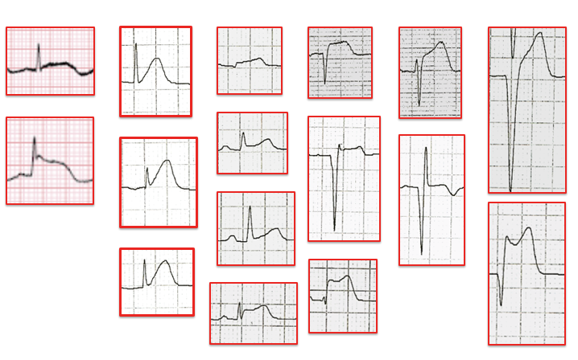
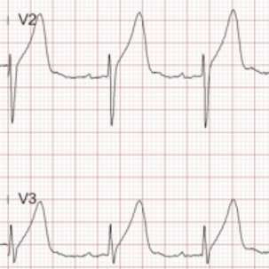
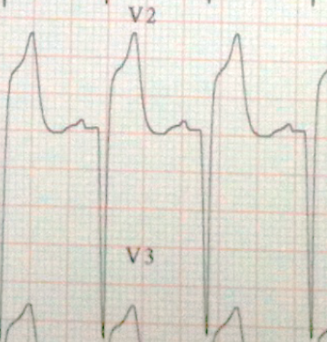
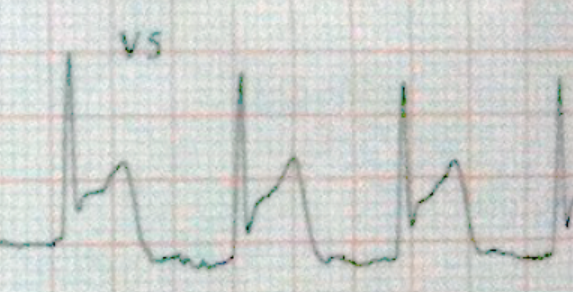
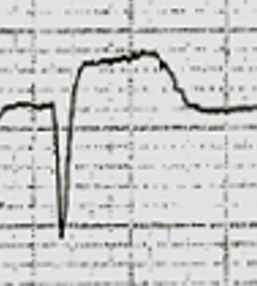
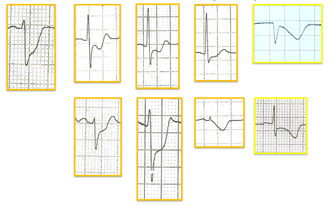
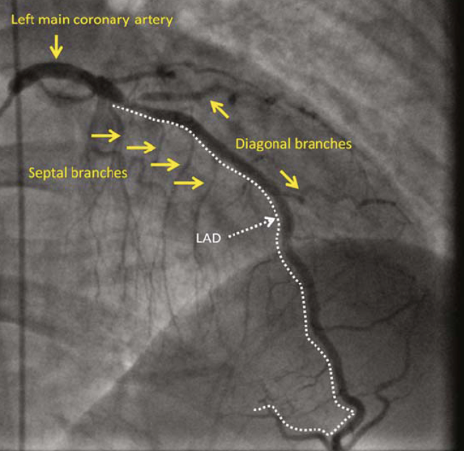
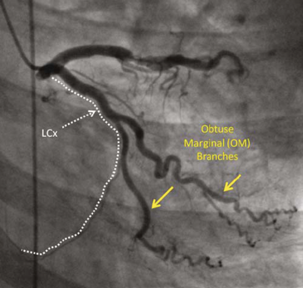
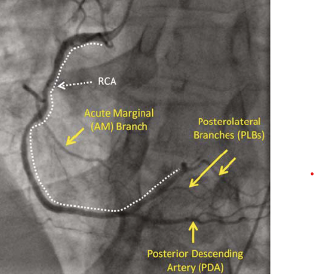

> 本頁由 LaTeX 原稿經 Pandoc 自動轉換，可能需少量人工微調。

# Early Diagnosis of Acute Myocardial Infarction- 前言

- 以前在intern時，讀過一本書，書名是Cope's Early Diagnosis of Acute Abdomen. 作者Zachary Cope在他的書中寫得很清楚，整本書跟evidence-based medicine無關，純粹是他個人診斷急性腹痛的經驗。全書他用栩栩如生的文字，將一個肚子痛的問診，理學檢查，以及診斷，洋洋灑灑寫了好幾萬字。讓讀的人有一個清楚的像貌，就算是沒真的接觸過perforate peptic ulcer, 也能在讀懂書之後，能夠有系統的處理，而不致於延誤診斷。這本書在經過Harvard Medical School的William Silen整理後，一直到現在還在出版。William Silen是唯一一個在Harrison's Internal Medicine有兩章是給外科醫師執筆的章節的作者。

- 現在當fellow了，在急診看過大大小小的AMI被delay診斷，不禁懷疑起一件事，為什麼書本都寫得清清楚楚的心肌梗塞的診斷方法，到了實際臨床要應用時，還是那麼困難？所有的胸痛，明明病人的症狀清楚，就因為對心電圖沒把握，所以一直要到cardiac enzymes高上去了，才能夠診斷AMI. 又或是常常cardiac enzymes因為顯而易見的原因而升高，但是因為lab data都列出來了，實在不容忽視，所以診斷又理所當然只剩下AMI, 而沒有其它的鑑別診斷了。

- 這份文件的目地只有一個，讓讀者對於心肌梗塞的病人，有一個清楚的輪廓，不要再在急診發生CV fellow到場，對於診斷過程跟處置，覺得不夠周延的場面了。

- 在evidence-based medicine跟guideline盛行的時代，有的時候，醫學的教育還是要訴諸經驗的傳承。所有的patient care不應該只照guideline處理，我想要強調的是：病患的照顧一定要individualized. 每個病人的表現都是unique的，前輩們的經驗，對照當代的evidence-based的研究，兩者合併，才是對的事。

# What Every Doctor Should Know

# Electrocardiography (心電圖) {#electrocardiography-心電圖 .unnumbered}

## Principles- **Never hesitate to repeat ECG** {#principles--never-hesitate-to-repeat-ecg .unnumbered}

當病人還在胸痛，還有症狀時，千萬要記得追蹤心電圖。如果是STEMI（ST elevation myocardial infarction），可以在短短的十五分鐘之內，由hyperacute T wave變成ST elevation。因此，如果第一張ECG是non-diagnostic（無法診斷），而病人又是持續性的胸痛（persistent pain），記得在十五分鐘之內再做一張ECG。千萬別等六小時再做，因為到時候可能已經出現QS pattern了。

心肌梗塞（myocardial infarction）的早期心電圖變化，以hyperacute T wave change最容易在急診第一時間被miss掉。2011-2015統計，所有被delay的STEMI當中，比例上，十張心電圖中，有七張都是因為沒有認出hyperacute T wave所致。另外要小心的是: 常常第一個看心電圖的醫師，只有看到reciprocal的ST depression，而忽略了其它lead可以見到的 ST elevation，以致於病人被當成NSTEMI治療（可是病患其實是STEMI!）。

{#images/ecg/fig_ST_elevation_pattern width="\\linewidth"}

# ECG waveform interpretation- 波型辨識

請先參考 Figure  [1](#images/ecg/fig_ST_elevation_pattern){reference-type="ref" reference="images/ecg/fig_ST_elevation_pattern"}，這張圖裡面整理了2011-2024年新竹台大分院急診室，收集到的各式ST elevation pattern圖譜。右邊的最好認，而越往左邊越難辨識。

+----------------------------------+---------------------------------------------------------------------------------------------------------------------------------------------------------------------------------------------------------------------------------------------+
| **項目**                         | **內容**                                                                                                                                                                                                                                    |
+:=================================+:============================================================================================================================================================================================================================================+
| *接續上一頁*                                                                                                                                                                                                                                                                   |
+----------------------------------+---------------------------------------------------------------------------------------------------------------------------------------------------------------------------------------------------------------------------------------------+
| **項目**                         | **內容**                                                                                                                                                                                                                                    |
+----------------------------------+---------------------------------------------------------------------------------------------------------------------------------------------------------------------------------------------------------------------------------------------+
| *接續下一頁*                                                                                                                                                                                                                                                                   |
+----------------------------------+---------------------------------------------------------------------------------------------------------------------------------------------------------------------------------------------------------------------------------------------+
| **Hyperacute T wave**            | {width="90%"} 這是hyperacute T wave的ECG, T wave很高，高得比R wave還高。同時可以見到ST segment明顯地拉上去了 (ST elevation).                                                          |
+----------------------------------+---------------------------------------------------------------------------------------------------------------------------------------------------------------------------------------------------------------------------------------------+
| **ST elevation**                 | {width="90%"}                                                                                                                                                                              |
|                                  |                                                                                                                                                                                                                                             |
|                                  | 請另外參考 Figure  [1](#images/ecg/fig_ST_elevation_pattern){reference-type="ref" reference="images/ecg/fig_ST_elevation_pattern"}.                                                                                                         |
+----------------------------------+---------------------------------------------------------------------------------------------------------------------------------------------------------------------------------------------------------------------------------------------+
|                                  | {width="50%"}                                                                                                                                                                                    |
|                                  |                                                                                                                                                                                                                                             |
|                                  | 在V2-3, QS都已經出來了，同時ST elevation也很明顯，這時的T wave還是upright. 另外可以見到的是: sinus tachycardia, 有個P wave在QS pattern之前。                                                                                                |
+----------------------------------+---------------------------------------------------------------------------------------------------------------------------------------------------------------------------------------------------------------------------------------------+
|                                  | {width="50%"}                                                                                                                                                                                    |
|                                  |                                                                                                                                                                                                                                             |
|                                  | 在V5還有R wave, 同時是很明顯的ST elevation, 跟上例一樣，如果連續兩個leads都有見到，那馬上就可以聯絡急導管了。按照經驗，這麼明確而且高的ST elevation, 一定是在相鄰的好幾個leads都見得到STE, 同時在其它導程，也會見到明顯的reciprocal change. |
+----------------------------------+---------------------------------------------------------------------------------------------------------------------------------------------------------------------------------------------------------------------------------------------+
| **QS pattern with ST elevation** | {width="50%"}                                                                                                                                                                                   |
+----------------------------------+---------------------------------------------------------------------------------------------------------------------------------------------------------------------------------------------------------------------------------------------+
| **T wave inversion**             | {width="90%"}                                                                                                                                                                                 |
+----------------------------------+---------------------------------------------------------------------------------------------------------------------------------------------------------------------------------------------------------------------------------------------+

: ECG waveform recognition

# 病史詢問與理學檢查- A timely approach 評估應該要注意時效

+----------------------+---------------------------------------------------------------------------------------------------------------------------------------------------------------------------------------------------------------------------------------------------------------------------------------------------------------------------------+
| **項目**             | **內容**                                                                                                                                                                                                                                                                                                                        |
+:=====================+:================================================================================================================================================================================================================================================================================================================================+
| *接續上一頁*                                                                                                                                                                                                                                                                                                                                           |
+----------------------+---------------------------------------------------------------------------------------------------------------------------------------------------------------------------------------------------------------------------------------------------------------------------------------------------------------------------------+
| **項目**             | **內容**                                                                                                                                                                                                                                                                                                                        |
+----------------------+---------------------------------------------------------------------------------------------------------------------------------------------------------------------------------------------------------------------------------------------------------------------------------------------------------------------------------+
| *接續下一頁*                                                                                                                                                                                                                                                                                                                                           |
+----------------------+---------------------------------------------------------------------------------------------------------------------------------------------------------------------------------------------------------------------------------------------------------------------------------------------------------------------------------+
| **胸痛病史詢問**     | 當第一時間知道病人有胸痛時，不論如何（不管胸痛多嚴重，或當時有其它任何complaint）都馬上立刻做一張心電圖。心電圖不應該有任何delay的理由。確定有人開始做心電圖之後，馬上跟病患的陪同者確認病史。待病患完成心電圖後，再把重要的訊息做確認，根據心電圖的發現，儘快做治療的決定。                                                    |
+----------------------+---------------------------------------------------------------------------------------------------------------------------------------------------------------------------------------------------------------------------------------------------------------------------------------------------------------------------------+
| **STEMI病史詢問**    | 病患常常除了胸痛之外，還會有全身性的主訴，像是覺得累，容易疲倦（malaise, frank exhaustion）。胸痛的性質也會不太一樣，有的老人家只講悶（結果做起來是LAD proximal total occlusion!），有的則是很痛很痛（intolerable pain）。胸痛的嚴重程度在STEMI時，當然是較嚴重，同時持續的時間也長（超過30分鐘，有的則長到好幾個小時都在痛）。 |
|                      |                                                                                                                                                                                                                                                                                                                                 |
|                      | 胸痛的病史詢問，務必記得要問 pain scale! 阿伯，請您現在跟我評分一下胸痛的指數是多少? 0分是不痛，1分是很輕的痛，10分是痛到受不了。請務必讓病人口述疼痛指數，不要只憑外觀表現幫病人評胸痛指數。當然如果病人已經插管，或是意識障礙，不然都應該要評疼痛指數。請注意，在急性冠心症的病患，評估不應該造成處置的延遲。                 |
+----------------------+---------------------------------------------------------------------------------------------------------------------------------------------------------------------------------------------------------------------------------------------------------------------------------------------------------------------------------+
| **胸痛的形容**       | 各式各樣形容chest pain的詞語：緊緊的（constricting）, crushing, oppressing, compressing, heavy weight, squeezing, 偶爾也會有atypical的詞：choking, viselike, stabbing, knifelike, boring, burning。痛的radiation典型的是痛到下巴，痛到雙肩，延著左前臂到手指，也會有只痛喉嚨或手腕的表現。                                      |
+----------------------+---------------------------------------------------------------------------------------------------------------------------------------------------------------------------------------------------------------------------------------------------------------------------------------------------------------------------------+
| **STEMI vs. Angina** | STEMI的痛通常會比unstable angina, stable angina來得更厲害，持續的時間更久，且對NTG無反應。                                                                                                                                                                                                                                      |
|                      |                                                                                                                                                                                                                                                                                                                                 |
|                      | 拜託千萬不要再發生下面的推理敘述: \"因為病患的疼痛對於NTG反應很差，所以應該不是STEMI。\" (這是完全錯誤的推論性敘述。                                                                                                                                                                                                            |
+----------------------+---------------------------------------------------------------------------------------------------------------------------------------------------------------------------------------------------------------------------------------------------------------------------------------------------------------------------------+
| **無痛STEMI**        | 在某些族群如elderly, women, diabetic patients, heart transplant patients，STEMI可能表現為胸悶、心衰、交感神經過度活化，而非典型的胸痛症狀。                                                                                                                                                                                     |
+----------------------+---------------------------------------------------------------------------------------------------------------------------------------------------------------------------------------------------------------------------------------------------------------------------------------------------------------------------------+
| **症狀誤診**         | inferior wall MI常表現為nausea/vomiting，容易被誤診為急性膽囊炎、消化性潰瘍、胃炎等。                                                                                                                                                                                                                                           |
+----------------------+---------------------------------------------------------------------------------------------------------------------------------------------------------------------------------------------------------------------------------------------------------------------------------------------------------------------------------+
| **其它症狀**         | profound weakness, dizziness, palpitations, cold perspiration, sense of impending doom。                                                                                                                                                                                                                                        |
+----------------------+---------------------------------------------------------------------------------------------------------------------------------------------------------------------------------------------------------------------------------------------------------------------------------------------------------------------------------+
| **藥物史詢問**       | 現在服用什麼藥？是否每天服用aspirin？是否有服用威而鋼？這些將決定治療決策。                                                                                                                                                                                                                                                     |
+----------------------+---------------------------------------------------------------------------------------------------------------------------------------------------------------------------------------------------------------------------------------------------------------------------------------------------------------------------------+
| **鑑別診斷**         | 發燒、畏寒、發抖寒顫、咳痰、頻尿等症狀的詢問可以幫助排除其他診斷。                                                                                                                                                                                                                                                              |
+----------------------+---------------------------------------------------------------------------------------------------------------------------------------------------------------------------------------------------------------------------------------------------------------------------------------------------------------------------------+

: 胸痛病史詢問與鑑別診斷

# 病歷調閱

+-----------------------------------+--------------------------------------------------------------------------------------------------------------------------------------------------------+
| **項目**                          | **內容**                                                                                                                                               |
+:==================================+:=======================================================================================================================================================+
| *接續上一頁*                                                                                                                                                                               |
+-----------------------------------+--------------------------------------------------------------------------------------------------------------------------------------------------------+
| **項目**                          | **內容**                                                                                                                                               |
+-----------------------------------+--------------------------------------------------------------------------------------------------------------------------------------------------------+
| *接續下一頁*                                                                                                                                                                               |
+-----------------------------------+--------------------------------------------------------------------------------------------------------------------------------------------------------+
| **Chart**                         | 病患之前的住院病摘要快速調閱，內容包括:                                                                                                                |
|                                   |                                                                                                                                                        |
|                                   | - 何時做的心導管？                                                                                                                                     |
|                                   |                                                                                                                                                        |
|                                   | - 幾條血管被involve？                                                                                                                                  |
|                                   |                                                                                                                                                        |
|                                   | - 放的是什麼支架？                                                                                                                                     |
|                                   |                                                                                                                                                        |
|                                   | - 以及有無合併其他共病（co-morbidity）如cancer, hypertension, diabetes mellitus, dyslipidemia？                                                        |
+-----------------------------------+--------------------------------------------------------------------------------------------------------------------------------------------------------+
| **ECG**                           | 心電圖可以在電腦系統中取得，所有團隊成員都必要要能夠熟悉電子病歷如何調閱心電圖。                                                                       |
+-----------------------------------+--------------------------------------------------------------------------------------------------------------------------------------------------------+
| **舊ECG的比較**                   | 什麼時候需要立刻跟舊的ECG做比較？需要知道病患的LBBB是否是舊的，是否早已有QS pattern with ST elevation（with apical aneurysm formation）。              |
+-----------------------------------+--------------------------------------------------------------------------------------------------------------------------------------------------------+
| **心臟超音波 (echocardiography)** | 如果病患之前做過心臟超音波，可以立即檢查LVEF（心臟收縮功能）及LVEDD（心臟是否擴大），並檢查有無valvular heart disease。重點應放在LVEF, LVEDD, MR或AR。 |
+-----------------------------------+--------------------------------------------------------------------------------------------------------------------------------------------------------+

: 病患住院病摘及心電圖資料檢視

# 第一張心電圖看不出問題!

+---------------------------------+------------------------------------------------------------------------------------------------------------------------------------------------------------+
| **項目**                        | **內容**                                                                                                                                                   |
+:================================+:===========================================================================================================================================================+
| *接續上一頁*                                                                                                                                                                                 |
+---------------------------------+------------------------------------------------------------------------------------------------------------------------------------------------------------+
| **項目**                        | **內容**                                                                                                                                                   |
+---------------------------------+------------------------------------------------------------------------------------------------------------------------------------------------------------+
| *接續下一頁*                                                                                                                                                                                 |
+---------------------------------+------------------------------------------------------------------------------------------------------------------------------------------------------------+
| **Negative ECG at First Scene** | 常常第一張心電圖是無法診斷的，這時請還是重視病患的臨床症狀和徵象。如果是明顯厲害的胸痛，仍然可以當作ACS或unstable angina來治療。接下來要繼續完成病史詢問。 |
+---------------------------------+------------------------------------------------------------------------------------------------------------------------------------------------------------+
| **Risk factors**                | 當不需要緊急進行心導管時，應花時間釐清風險因子。                                                                                                           |
+---------------------------------+------------------------------------------------------------------------------------------------------------------------------------------------------------+
| **風險因子**                    | - 年齡 (Age)                                                                                                                                               |
|                                 |                                                                                                                                                            |
|                                 | - 冠狀動脈疾病史 (History of CAD)                                                                                                                          |
|                                 |                                                                                                                                                            |
|                                 | - 男性 (Male gender)                                                                                                                                       |
|                                 |                                                                                                                                                            |
|                                 | - 吸菸者 (Active smoker)                                                                                                                                   |
|                                 |                                                                                                                                                            |
|                                 | - 糖尿病 (Diabetes mellitus)                                                                                                                               |
|                                 |                                                                                                                                                            |
|                                 | - 血脂異常 (Dyslipidemia)                                                                                                                                  |
|                                 |                                                                                                                                                            |
|                                 | - 家族冠狀動脈疾病或AMI史 (Family history of CAD/AMI)                                                                                                      |
+---------------------------------+------------------------------------------------------------------------------------------------------------------------------------------------------------+
| **風險因子缺乏的情況**          | 即使患者沒有任何風險因子，仍不能因此排除心肌缺血，仍應依臨床證據為主。                                                                                     |
+---------------------------------+------------------------------------------------------------------------------------------------------------------------------------------------------------+
| **年輕患者發生AMI的情況**       | 以下幾種情況應特別鑑別，因其可能導致年輕患者發生AMI：                                                                                                      |
|                                 |                                                                                                                                                            |
|                                 | - 冠狀動脈先天異常 (Coronary congenital anomaly)                                                                                                           |
|                                 |                                                                                                                                                            |
|                                 | - 童年患川崎病伴冠狀動脈瘤 (Kawasaki disease in childhood with coronary aneurysm)                                                                          |
|                                 |                                                                                                                                                            |
|                                 | - 產後女性 (Female in post-partum status)                                                                                                                  |
|                                 |                                                                                                                                                            |
|                                 | - 可卡因或其他藥物成癮 (Cocaine use or other drug addiction)                                                                                               |
|                                 |                                                                                                                                                            |
|                                 | - 嗜鉻細胞瘤 (Pheochromocytoma)                                                                                                                            |
|                                 |                                                                                                                                                            |
|                                 | - 感染性心內膜炎導致冠狀動脈栓塞 (Coronary emboli from infective endocarditis)                                                                             |
+---------------------------------+------------------------------------------------------------------------------------------------------------------------------------------------------------+

: Negative ECG at First Scene與風險因子分析

# 共病的確認

+--------------------------------------------------+-----------------------------------------------------------------------------------------------------------------------------------------------------------------------------------------------------------------------------------------------------------------------------------------------------------------------------------------------------------------+
| **項目**                                         | **內容**                                                                                                                                                                                                                                                                                                                                                        |
+:=================================================+:================================================================================================================================================================================================================================================================================================================================================================+
| *接續上一頁*                                                                                                                                                                                                                                                                                                                                                                                                       |
+--------------------------------------------------+-----------------------------------------------------------------------------------------------------------------------------------------------------------------------------------------------------------------------------------------------------------------------------------------------------------------------------------------------------------------+
| **項目**                                         | **內容**                                                                                                                                                                                                                                                                                                                                                        |
+--------------------------------------------------+-----------------------------------------------------------------------------------------------------------------------------------------------------------------------------------------------------------------------------------------------------------------------------------------------------------------------------------------------------------------+
| *接續下一頁*                                                                                                                                                                                                                                                                                                                                                                                                       |
+--------------------------------------------------+-----------------------------------------------------------------------------------------------------------------------------------------------------------------------------------------------------------------------------------------------------------------------------------------------------------------------------------------------------------------+
| **Comorbidity identification**                   | 病患的胸痛屬實，第一個還是要考慮心肌缺血 (myocardial ischemia)。以下是最重要的AMI鑑別診斷及合併症 (comorbidity)：                                                                                                                                                                                                                                               |
|                                                  |                                                                                                                                                                                                                                                                                                                                                                 |
|                                                  | - 主動脈剝離 (Aortic dissection)                                                                                                                                                                                                                                                                                                                                |
|                                                  |                                                                                                                                                                                                                                                                                                                                                                 |
|                                                  | - 肺栓塞 (Pulmonary embolism)                                                                                                                                                                                                                                                                                                                                   |
|                                                  |                                                                                                                                                                                                                                                                                                                                                                 |
|                                                  | - 心包炎 (Pericarditis)                                                                                                                                                                                                                                                                                                                                         |
|                                                  |                                                                                                                                                                                                                                                                                                                                                                 |
|                                                  | - 敗血症 (Sepsis)                                                                                                                                                                                                                                                                                                                                               |
+--------------------------------------------------+-----------------------------------------------------------------------------------------------------------------------------------------------------------------------------------------------------------------------------------------------------------------------------------------------------------------------------------------------------------------+
| **Sepsis patients**                              | 對於sepsis的病人，不應魯莽地進行急導管檢查，這常會讓病患的病情更加惡化。 試想一個sepsis合併DIC、多器官衰竭（包括急性腎衰竭）的病人，如果進行導管檢查，接受大量造影劑的暴露，再放置支架並使用heparin，可能導致更加嚴重的後果。敗血症引起的心肌抑制通常是可逆的，通過正確的抗生素治療和足夠的支持性管理（如呼吸機、CVVH支持，有時甚至需要IABP），病情有可能逆轉。 |
+--------------------------------------------------+-----------------------------------------------------------------------------------------------------------------------------------------------------------------------------------------------------------------------------------------------------------------------------------------------------------------------------------------------------------------+
| **鑑別診斷: Cardiogenic shock vs. Septic shock** | 在許多情況下，無需依靠導管診斷即可鑑別心源性休克和敗血性休克。我們應依據臨床表現及相關檢查來做出診斷。                                                                                                                                                                                                                                                          |
+--------------------------------------------------+-----------------------------------------------------------------------------------------------------------------------------------------------------------------------------------------------------------------------------------------------------------------------------------------------------------------------------------------------------------------+
| **Elevated Troponin-I 鑑別診斷**                 | 如果病人Troponin-I升高，需謹慎鑑別原因，重要的鑑別診斷包括：                                                                                                                                                                                                                                                                                                    |
|                                                  |                                                                                                                                                                                                                                                                                                                                                                 |
|                                                  | - 心肌梗塞 (Myocardial infarction)                                                                                                                                                                                                                                                                                                                              |
|                                                  |                                                                                                                                                                                                                                                                                                                                                                 |
|                                                  | - 敗血症 (Sepsis)                                                                                                                                                                                                                                                                                                                                               |
|                                                  |                                                                                                                                                                                                                                                                                                                                                                 |
|                                                  | - 肺栓塞 (Pulmonary embolism)                                                                                                                                                                                                                                                                                                                                   |
|                                                  |                                                                                                                                                                                                                                                                                                                                                                 |
|                                                  | - 腎功能不全 (Renal insufficiency)                                                                                                                                                                                                                                                                                                                              |
|                                                  |                                                                                                                                                                                                                                                                                                                                                                 |
|                                                  | - 一過性心室上性心搏過速 (Transient supraventricular tachycardia)                                                                                                                                                                                                                                                                                               |
|                                                  |                                                                                                                                                                                                                                                                                                                                                                 |
|                                                  | - CPR後或電擊後 (Post CPR/DC shock)                                                                                                                                                                                                                                                                                                                             |
|                                                  |                                                                                                                                                                                                                                                                                                                                                                 |
|                                                  | - 胃腸道出血 (GI bleeding)                                                                                                                                                                                                                                                                                                                                      |
+--------------------------------------------------+-----------------------------------------------------------------------------------------------------------------------------------------------------------------------------------------------------------------------------------------------------------------------------------------------------------------------------------------------------------------+
| **GI bleeding and PCI**                          | 有些AMI病人的問題不是因為延遲進行PCI，而是由於胃腸道出血造成的繼發性心肌缺血。導管手術成功或失敗的同時，病人在CCU中可能會出現難以控制的GI出血。這些病人因為已經放置了支架並使用了heparin，導致GI出血無法止住，最終可能因出血而死亡。導管雖然成功，但病人卻因此喪命，這是非常令人遺憾的情況。                                                                    |
+--------------------------------------------------+-----------------------------------------------------------------------------------------------------------------------------------------------------------------------------------------------------------------------------------------------------------------------------------------------------------------------------------------------------------------+
| **病史詢問 (Hx)**                                | 最近三天有沒有解黑便（tarry stool）？有沒有消化性潰瘍病史、GERD，或者曾經進行過腹部手術？                                                                                                                                                                                                                                                                       |
+--------------------------------------------------+-----------------------------------------------------------------------------------------------------------------------------------------------------------------------------------------------------------------------------------------------------------------------------------------------------------------------------------------------------------------+
| **理學檢查 (PE)**                                | 檢查病人的結膜是否蒼白（pale conjunctivae）、手掌是否蒼白（pale palm）、嘴唇是否蒼白（pale lips）？這些基本的檢查可以幫助決定是否需要進行直腸指診（digital anal exam）。                                                                                                                                                                                        |
+--------------------------------------------------+-----------------------------------------------------------------------------------------------------------------------------------------------------------------------------------------------------------------------------------------------------------------------------------------------------------------------------------------------------------------+
| **治療 (Tx)**                                    | 如果上消化道出血的證據確鑿，請勿給予aspirin或heparin。應先糾正貧血。如果病人同時有嚴重的胸痛，則應直接使用抗血小板藥物（如clopidogrel）和抗心絞痛藥物（如NTG）。至於是否使用aspirin、heparin或進行PCI，需由心臟科醫師決定。                                                                                                                                     |
+--------------------------------------------------+-----------------------------------------------------------------------------------------------------------------------------------------------------------------------------------------------------------------------------------------------------------------------------------------------------------------------------------------------------------------+

: 合併症鑑別診斷與處理

# 理學檢查

+-------------------------------------+-----------------------------------------------------------------------------------------------------------------------------------------------------------------------------------------------------------------------------------------------------------------------------------------------------------------------------------------------------------------------------+
| **項目**                            | **內容**                                                                                                                                                                                                                                                                                                                                                                    |
+:====================================+:============================================================================================================================================================================================================================================================================================================================================================================+
| *接續上一頁*                                                                                                                                                                                                                                                                                                                                                                                                      |
+-------------------------------------+-----------------------------------------------------------------------------------------------------------------------------------------------------------------------------------------------------------------------------------------------------------------------------------------------------------------------------------------------------------------------------+
| **項目**                            | **內容**                                                                                                                                                                                                                                                                                                                                                                    |
+-------------------------------------+-----------------------------------------------------------------------------------------------------------------------------------------------------------------------------------------------------------------------------------------------------------------------------------------------------------------------------------------------------------------------------+
| *接續下一頁*                                                                                                                                                                                                                                                                                                                                                                                                      |
+-------------------------------------+-----------------------------------------------------------------------------------------------------------------------------------------------------------------------------------------------------------------------------------------------------------------------------------------------------------------------------------------------------------------------------+
| **Physical examination (理學檢查)** | STEMI病人的理學檢查應關注於其外觀和徵象，這些可幫助判斷病情的嚴重程度。                                                                                                                                                                                                                                                                                                     |
+-------------------------------------+-----------------------------------------------------------------------------------------------------------------------------------------------------------------------------------------------------------------------------------------------------------------------------------------------------------------------------------------------------------------------------+
| **General appearance of STEMI**     | STEMI病人（或其他重症病人）通常會顯得焦慮緊張（anxious），並表現出極度的痛苦或不適（in considerable distress）。病人通常會不安地在床上扭動（restless），相較之下，單純的心絞痛（angina）病人會比較平靜，因為他們知道任何動作都可能加重胸痛。STEMI病人幾乎找不到一個舒服的姿勢。                                                                                             |
+-------------------------------------+-----------------------------------------------------------------------------------------------------------------------------------------------------------------------------------------------------------------------------------------------------------------------------------------------------------------------------------------------------------------------------+
| **胸部動作與Levine's sign**         | 病人可能會不自覺地按摩或捶打自己的胸部（massage or clutch their chests），經常在胸口上做出握拳動作（clenched fist over chest），這是表達疼痛的典型動作（Levine's sign, named after Dr. Samuel A. Levine）。                                                                                                                                                                 |
+-------------------------------------+-----------------------------------------------------------------------------------------------------------------------------------------------------------------------------------------------------------------------------------------------------------------------------------------------------------------------------------------------------------------------------+
| **LV dysfunction徵象**              | 如果病人有左心室功能不全（LV dysfunction），因交感神經刺激（sympathetic stimulation），會伴隨盜汗（cold perspiration）和臉色蒼白（skin pallor）。病人的呼吸模式也會改變，這通常是由於肺部充血和水腫（lung congestion and edema）的進展所致，因此病人可能會坐在床邊張口喘氣（gasping）。很多中年男性會描述喉嚨緊繃，像是被掐住一般，感到呼吸困難（feeling of suffocation）。 |
+-------------------------------------+-----------------------------------------------------------------------------------------------------------------------------------------------------------------------------------------------------------------------------------------------------------------------------------------------------------------------------------------------------------------------------+
| **咳嗽與肺水腫**                    | 如果病人開始狂咳，或咳出粉紅色泡沫痰（pink frothy sputum），這往往代表病情已經進展到明顯的肺水腫（frank lung edema）。                                                                                                                                                                                                                                                      |
+-------------------------------------+-----------------------------------------------------------------------------------------------------------------------------------------------------------------------------------------------------------------------------------------------------------------------------------------------------------------------------------------------------------------------------+
| **Cardiogenic shock徵象**           | 當病人進入心源性休克狀態（cardiogenic shock status）時，病人通常會一動不動地躺在床上（listless or lethargic）。其皮膚看起來非常蒼白（pallor），並且摸起來冰冷潮濕（cold and clammy）。四肢可能出現斑紋狀紋路（mottling），呈現藍或白色。四肢、指甲床及嘴唇可能出現發紺（cyanosis）。                                                                                        |
+-------------------------------------+-----------------------------------------------------------------------------------------------------------------------------------------------------------------------------------------------------------------------------------------------------------------------------------------------------------------------------------------------------------------------------+
| **CNS方面徵象**                     | 隨著休克的嚴重程度進展，病人可能會變得意識模糊或混亂（disoriented and confusion）。                                                                                                                                                                                                                                                                                         |
+-------------------------------------+-----------------------------------------------------------------------------------------------------------------------------------------------------------------------------------------------------------------------------------------------------------------------------------------------------------------------------------------------------------------------------+
| **Severe shock表現**                | 這些表現通常見於重度休克的病人。有時候，即使病人血壓並未降低，依然可以處於休克狀態（normotensive shock）。因此，不應僅依據血壓做臨床判斷，而應根據病人的其他嚴重徵象來做出診斷和治療計劃。                                                                                                                                                                                  |
+-------------------------------------+-----------------------------------------------------------------------------------------------------------------------------------------------------------------------------------------------------------------------------------------------------------------------------------------------------------------------------------------------------------------------------+

: STEMI患者的理學檢查

# 冠狀動脈血管攝影 Primer

+------------------------------------------------+---------------------------------------------------------+
| **項目**                                       | **內容**                                                |
+:===============================================+:========================================================+
| *接續上一頁*                                                                                             |
+------------------------------------------------+---------------------------------------------------------+
| **項目**                                       | **內容**                                                |
+------------------------------------------------+---------------------------------------------------------+
| *接續下一頁*                                                                                             |
+------------------------------------------------+---------------------------------------------------------+
| **Left coronary artery, LCA**                  | {width="90%"} |
+------------------------------------------------+---------------------------------------------------------+
| **Left coronary artery, LCA, RAO CAUDAL view** | {width="90%"} |
+------------------------------------------------+---------------------------------------------------------+
| **Right coronary artery, RCA**                 | {width="90%"}   |
+------------------------------------------------+---------------------------------------------------------+

: Coronary angiography primer
