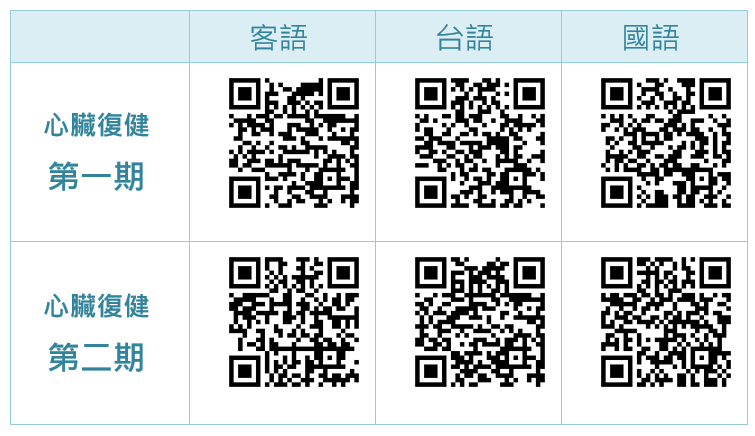
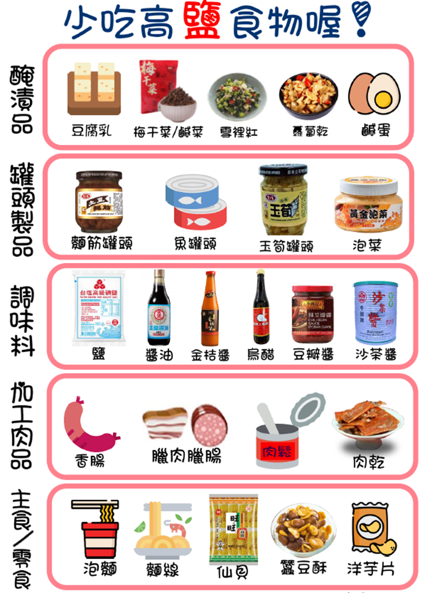
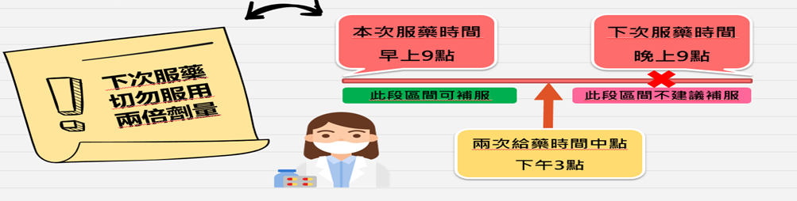

> 本頁由 LaTeX 原稿經 Pandoc 自動轉換，可能需少量人工微調。

# 前言 {#前言 .unnumbered}

先生、女士您好： 住院期間將啟動心臟衰竭照護及衛教計畫，依個別性照會營養師、物理治療師、藥師等，提供衛教指導，若有疑問請隨時與醫護團隊反應；個管師將於出院後3日內電訪，追蹤返家適應情形，若有相關問題可於電訪中詢問。

# 查檢表 {#查檢表 .unnumbered}

+----------------------------------------------------------------------------+
| **心臟衰竭衛教查檢表**                                                     |
+:=================+:====================================+:==================+
| **項目**         | **內容/聯絡方式**                   | **執行者 / 日期** |
+------------------+-------------------------------------+-------------------+
| **心臟衰竭衛教查檢表（續）**                                               |
+------------------+-------------------------------------+-------------------+
| **項目**         | **內容/聯絡方式**                   | **執行者 / 日期** |
+------------------+-------------------------------------+-------------------+
| **【自我管理】** | 29247385 (08:30-12:00; 14:00-17:00) | 心衰個管師 / 日期 |
+------------------+-------------------------------------+-------------------+
|                  | □ 心臟衰竭簡介                      |                   |
+------------------+-------------------------------------+-------------------+
|                  | □ 心衰日常照護須知                  |                   |
+------------------+-------------------------------------+-------------------+
|                  | □ 心衰治療注意事項                  |                   |
+------------------+-------------------------------------+-------------------+
|                  | □ 返家緊急狀況處置                  |                   |
+------------------+-------------------------------------+-------------------+
|                  | □ 其他：                            |                   |
+------------------+-------------------------------------+-------------------+
| **【心肺復健】** | 523513 (08:30-12:00; 14:00-17:00)   | 物理治療師 / 日期 |
+------------------+-------------------------------------+-------------------+
|                  | □ 第一期心肺復健 / 危險分級         |                   |
+------------------+-------------------------------------+-------------------+
|                  | □ 居家復健計畫說明                  |                   |
+------------------+-------------------------------------+-------------------+
|                  | □ 臨床諮詢指導                      |                   |
+------------------+-------------------------------------+-------------------+
|                  | □ 第二期心肺復健計畫                |                   |
+------------------+-------------------------------------+-------------------+
|                  | □ 其他：                            |                   |
+------------------+-------------------------------------+-------------------+
| **【營養評估】** | 524304 (08:00-17:00)                | 營養師 / 日期     |
+------------------+-------------------------------------+-------------------+
|                  | □ 營養評估 / 飲食評估               |                   |
+------------------+-------------------------------------+-------------------+
|                  | □ 飲食建議 / 共病控制教育           |                   |
+------------------+-------------------------------------+-------------------+
|                  | □ 臨床諮詢指導                      |                   |
+------------------+-------------------------------------+-------------------+
|                  | □ 其他：                            |                   |
+------------------+-------------------------------------+-------------------+
| **【藥物控制】** | 藥物諮詢專線：524102 (08:30-17:30)  | 藥師 / 日期       |
+------------------+-------------------------------------+-------------------+
|                  | □ 用藥評估 / 共病控制教育           |                   |
+------------------+-------------------------------------+-------------------+
|                  | □ 臨床諮詢指導                      |                   |
+------------------+-------------------------------------+-------------------+
|                  | □ 其他：                            |                   |
+------------------+-------------------------------------+-------------------+
| **【戒菸衛教】** | 523734 (08:30-17:00)                | 戒菸個管師 / 日期 |
+------------------+-------------------------------------+-------------------+
|                  | □ 煙癮評估 / 戒菸衛教               |                   |
+------------------+-------------------------------------+-------------------+
|                  | □ 戒菸藥物諮詢                      |                   |
+------------------+-------------------------------------+-------------------+
|                  | □ 無抽菸史，□ 已戒菸                |                   |
+------------------+-------------------------------------+-------------------+
| **病人簽收**     |                                     |                   |
+------------------+-------------------------------------+-------------------+

## 目的 {#目的 .unnumbered}

<figure id="images/rehab/fig cv rehab education nurse">

*醫療上，團隊溝通的重要性: 團隊不是只有醫師，在新竹台大分院，我們有完整的跨團隊合作模式，如果您發現不認識的醫護同仁，來關心您，而且發現他/她對您的病情很了解，請不用緊張喔!

<figcaption>因為人力關係，我們還作不到居家訪視，但是這個是未來期待的目標。</figcaption>
</figure>

# 物理治療-心臟復健運動

心臟復健是對患有心臟疾病的病人，進行規律運動訓練。訓練過程中物理治療師會監控病人的心跳、血壓、血氧與臨床徵候，以求達到增加心肺耐力或體適能來回復正常生活活動及職場所需。**心臟復健分為三期**：

- **第一期**是住院期及轉銜期(約4-6週)

- **第二期**是門診復健期(約3-6個月)

- **第三期**是維持期(病人居家自行維持心臟復健運動)

**文獻統計資料顯示：有進行心臟復建的心臟衰竭病人，可降低死亡率與再住院率達35%。**

::: {#tab:benefits}
+----------+--------------------+
| **編號** | **好處說明**       |
+:=========+:===================+
| Table  -- 續上頁              |
+----------+--------------------+
| **編號** | **好處說明**       |
+----------+--------------------+
| 續下頁                        |
+----------+--------------------+
| 1        | 降低再住院率       |
+----------+--------------------+
| 2        | 降低死亡率         |
+----------+--------------------+
| 3        | 減低心臟病危險因子 |
+----------+--------------------+
| 4        | 降低膽固醇         |
+----------+--------------------+
| 5        | 協助控制血糖、血壓 |
+----------+--------------------+
| 6        | 放鬆心情           |
+----------+--------------------+
| 7        | 增強心肺耐力       |
+----------+--------------------+

: 進行心臟復健的好處
:::

## 運動計畫 {#運動計畫 .unnumbered}

- 有氧運動，如：步行、騎腳踏車等；先做間歇式運動，再慢慢增加時間，以達到連續運動20到30分鐘為目標。

- 肌力訓練：上肢及下肢抗重力或阻力運動，可做10-15下/組，重複2-3組。

## 須減緩或停止活動的情況 {#須減緩或停止活動的情況 .unnumbered}

1.  胸痛、心絞痛、氣喘、呼吸困難、頭暈目眩、噁心嘔吐、臉色發白、發紺等

2.  身心疲勞或肌肉痠痛無力

3.  不適當的心跳或血壓反應：出院初期，運動時每分鐘心跳超出休息時的20下以上，或運動後心跳低於休息時心跳10下；收縮壓大於200mmHg，舒張壓大於110mmHg

## 適當的運動強度應為 {#適當的運動強度應為 .unnumbered}

適度流汗、呼吸增快、短暫且非不愉快的疲累，同時能與人維持正常談話。

## 活動注意事項 {#活動注意事項 .unnumbered}

- 避免推、拉、抬、舉重物與憋氣用力的活動以減少對心臟的負荷。

- 避免溫度過高、過低或濕度過高的地方活動。

- 勿從事競賽型活動。

- 運動必須包含5至10分鐘的暖身及緩和活動。

- 運動時間，為飯後1至2小時後，且飯前避免食用刺激性食物。

- 感冒及身心疲勞請勿運動。

## 線上影音復健資源 {#線上影音復健資源 .unnumbered}

{#images/rehab/fig_cardiac rehab QR code width="100%"}

# 飲食注意事項

::: {#tab:nutrition}
+------------------------+----------------------------------------------------------------------------------------------------------------------------------------------------------------------------------------------------------------------------------------------------------------+
| **主題**               | **內容說明**                                                                                                                                                                                                                                                   |
+:=======================+:===============================================================================================================================================================================================================================================================+
| Table  -- 續上頁                                                                                                                                                                                                                                                                        |
+------------------------+----------------------------------------------------------------------------------------------------------------------------------------------------------------------------------------------------------------------------------------------------------------+
| **主題**               | **內容說明**                                                                                                                                                                                                                                                   |
+------------------------+----------------------------------------------------------------------------------------------------------------------------------------------------------------------------------------------------------------------------------------------------------------+
| 續下頁                                                                                                                                                                                                                                                                                  |
+------------------------+----------------------------------------------------------------------------------------------------------------------------------------------------------------------------------------------------------------------------------------------------------------+
| 基本原則               | 良好的營養狀況有助於心衰竭患者維持病況，適當的攝取身體所需要的熱量及營養素能保護患者心臟及維持較佳的健康狀況。建議和營養師討論每日的熱量及營養需求。當食慾下降及進食量減少時，建議以少量多餐的方式進食。另外，可考慮補充適當的「濃縮營養品」，補足攝取的不足。 |
+------------------------+----------------------------------------------------------------------------------------------------------------------------------------------------------------------------------------------------------------------------------------------------------------+
| 低鈉飲食說明           | 鈉離子在人體中主要負責調控體內水分的平衡。過多的「鈉」離子會使身體水份累積、高血壓、肺積水、增加心臟的負荷。鈉離子廣泛存在於食物中，是鹽、味精、蕃茄醬、豆瓣醬、味噌、咖哩、干貝醬等**調味料**的主要成分之一。                                                 |
+------------------------+----------------------------------------------------------------------------------------------------------------------------------------------------------------------------------------------------------------------------------------------------------------+
| 低鈉食物選擇與烹飪技巧 | - 建議每日限鹽**3公克（1200毫克鈉）至5公克（2000毫克鈉）**                                                                                                                                                                                                     |
|                        |                                                                                                                                                                                                                                                                |
|                        | - 選擇天然食材，以新鮮食物本身的原味為主                                                                                                                                                                                                                       |
|                        |                                                                                                                                                                                                                                                                |
|                        | - **避免加工、罐頭及醃製、滷製食品**                                                                                                                                                                                                                           |
|                        |                                                                                                                                                                                                                                                                |
|                        | - 忌鈉含量高加工食品                                                                                                                                                                                                                                           |
|                        |                                                                                                                                                                                                                                                                |
|                        | - 多善用天然食材的香氣調味                                                                                                                                                                                                                                     |
|                        |                                                                                                                                                                                                                                                                |
|                        | - **減少鈉含量高的調味料使用**                                                                                                                                                                                                                                 |
|                        |                                                                                                                                                                                                                                                                |
|                        | - 注意市售低鈉產品的成分                                                                                                                                                                                                                                       |
|                        |                                                                                                                                                                                                                                                                |
|                        | - 閱讀包裝食品的「鈉」含量標示                                                                                                                                                                                                                                 |
+------------------------+----------------------------------------------------------------------------------------------------------------------------------------------------------------------------------------------------------------------------------------------------------------+
| 外食減鹽技巧           | - 飯類：避免加鹽與醬油烹煮的飯類、不額外淋滷肉汁或菜湯                                                                                                                                                                                                         |
|                        |                                                                                                                                                                                                                                                                |
|                        | - 麵類：建議選擇湯麵但是不喝湯、選擇水煮水餃，不再沾醬料，可沾白醋。若菜餚醬料過多過鹹，可以熱水涮洗過再吃。                                                                                                                                                   |
+------------------------+----------------------------------------------------------------------------------------------------------------------------------------------------------------------------------------------------------------------------------------------------------------+
| 水分控制原則           | 體內過多的水份易增加心臟的負荷，可能會出現水腫或呼吸急促等症狀，需遵循醫囑控制每日水分攝取。                                                                                                                                                                   |
+------------------------+----------------------------------------------------------------------------------------------------------------------------------------------------------------------------------------------------------------------------------------------------------------+
| 水分控制技巧           | - **每日起床排尿後用餐前**稱重，**逐日記錄體重**                                                                                                                                                                                                               |
|                        |                                                                                                                                                                                                                                                                |
|                        | - 計算固體食物中的水分含量                                                                                                                                                                                                                                     |
|                        |                                                                                                                                                                                                                                                                |
|                        | - 使用固定容器盛裝飲水                                                                                                                                                                                                                                         |
|                        |                                                                                                                                                                                                                                                                |
|                        | - **避免攝取過多湯汁、飲料等**                                                                                                                                                                                                                                 |
|                        |                                                                                                                                                                                                                                                                |
|                        | - 注意高含水量食物的攝取量                                                                                                                                                                                                                                     |
+------------------------+----------------------------------------------------------------------------------------------------------------------------------------------------------------------------------------------------------------------------------------------------------------+
| 解渴小技巧             | - **用開水漱口，再將水吐出**                                                                                                                                                                                                                                   |
|                        |                                                                                                                                                                                                                                                                |
|                        | - 可以口含冰塊或檸檬汁冰塊（需納入水分計算）                                                                                                                                                                                                                   |
|                        |                                                                                                                                                                                                                                                                |
|                        | - 咀嚼清涼口香糖或喉糖                                                                                                                                                                                                                                         |
|                        |                                                                                                                                                                                                                                                                |
|                        | - 使用護唇膏保持嘴唇濕潤                                                                                                                                                                                                                                       |
+------------------------+----------------------------------------------------------------------------------------------------------------------------------------------------------------------------------------------------------------------------------------------------------------+

: 心衰竭患者的營養建議與注意事項
:::

{#images/rehab/fig_cardiac rehab diet width="100%"}

# 戒菸-我想戒菸有什麼方法？

::: {#tab:smoking}
+----------------+----------------------------------------------------------------------------------------------------------------------------------------------+
| **主題**       | **說明內容**                                                                                                                                 |
+:===============+:=============================================================================================================================================+
| Table  -- 續上頁                                                                                                                                              |
+----------------+----------------------------------------------------------------------------------------------------------------------------------------------+
| **主題**       | **說明內容**                                                                                                                                 |
+----------------+----------------------------------------------------------------------------------------------------------------------------------------------+
| 續下頁                                                                                                                                                        |
+----------------+----------------------------------------------------------------------------------------------------------------------------------------------+
| 吸菸危害       | - 加重心臟負擔並加速病情惡化                                                                                                                 |
|                |                                                                                                                                              |
|                | - 尼古丁和一氧化碳會收縮血管、升高血壓                                                                                                       |
|                |                                                                                                                                              |
|                | - 促進動脈粥狀硬化，加劇心肌缺氧                                                                                                             |
|                |                                                                                                                                              |
|                | - 降低藥物治療效果                                                                                                                           |
|                |                                                                                                                                              |
|                | - 增加住院率與死亡率                                                                                                                         |
+----------------+----------------------------------------------------------------------------------------------------------------------------------------------+
| 戒菸效益       | - 顯著改善心衰竭患者的預後                                                                                                                   |
|                |                                                                                                                                              |
|                | - 減少併發症                                                                                                                                 |
|                |                                                                                                                                              |
|                | - 提升生活品質                                                                                                                               |
+----------------+----------------------------------------------------------------------------------------------------------------------------------------------+
| 現況分析       | 研究調查顯示，吸菸者有70%曾嘗試戒菸，但未經由專業協助，短期戒菸成功率不到10%。需要配合戒菸專業輔導機構與正確使用輔助藥物，以提高戒菸成功率。 |
+----------------+----------------------------------------------------------------------------------------------------------------------------------------------+
| **戒菸明星(STAR)計畫**                                                                                                                                        |
+----------------+----------------------------------------------------------------------------------------------------------------------------------------------+
| S (Set)        | 慎重設定戒菸日，2週內！                                                                                                                      |
+----------------+----------------------------------------------------------------------------------------------------------------------------------------------+
| T (Tell)       | 公開決心，爭取支持，昭告眾親朋好友！                                                                                                         |
+----------------+----------------------------------------------------------------------------------------------------------------------------------------------+
| A (Anticipate) | 預期戒菸過程可能會遇到的困難！認識戒斷症候群，詳讀。                                                                                         |
+----------------+----------------------------------------------------------------------------------------------------------------------------------------------+
| R (Remove)     | 移除引起吸菸念頭的一切及用品。                                                                                                               |
+----------------+----------------------------------------------------------------------------------------------------------------------------------------------+
| 補充說明       | 本院備有戒菸教戰手冊「戒菸教戰手冊」，歡迎索取。                                                                                             |
+----------------+----------------------------------------------------------------------------------------------------------------------------------------------+

: 戒菸衛教資訊
:::

## 戒菸方法比較 {#戒菸方法比較 .unnumbered}

::: {#tab:smoking-comparison}
+--------------+--------------------------------+-------------------------------------------------+----------------------------------------+--------------------------------------------+
| **項目**     | **靠意志力戒菸**               | **戒菸諮詢**                                    | **戒菸藥物**                           | **戒菸藥物+諮詢**                          |
+:=============+:===============================+:================================================+:=======================================+:===========================================+
| Table  -- 續上頁                                                                                                                                                                      |
+--------------+--------------------------------+-------------------------------------------------+----------------------------------------+--------------------------------------------+
| **項目**     | **靠意志力戒菸**               | **戒菸諮詢**                                    | **戒菸藥物**                           | **戒菸藥物+諮詢**                          |
+--------------+--------------------------------+-------------------------------------------------+----------------------------------------+--------------------------------------------+
| 續下頁                                                                                                                                                                                |
+--------------+--------------------------------+-------------------------------------------------+----------------------------------------+--------------------------------------------+
| 選項要做的事 | - 絕對不吸菸                   | 到提供戒菸服務的醫事機構\                       | 同戒菸諮詢                             | 同戒菸諮詢                                 |
|              |                                | 台大新竹醫院戒菸(03)5326151 轉 523551 或 523734 |                                        |                                            |
|              | - 環境沒有菸                   |                                                 |                                        |                                            |
|              |                                |                                                 |                                        |                                            |
|              | - 告知週遭自己要戒菸           |                                                 |                                        |                                            |
|              |                                |                                                 |                                        |                                            |
|              | - 想抽菸時，想戒菸理由         |                                                 |                                        |                                            |
+--------------+--------------------------------+-------------------------------------------------+----------------------------------------+--------------------------------------------+
| 成功率       | 3-5%                           | 24.4%\                                          | 25.2%\                                 | 27.6%\                                     |
|              |                                | (低度菸癮戒菸成功率)                            | (中高度菸癮以上戒菸成功率)             | (中高度菸癮以上戒菸成功率)                 |
+--------------+--------------------------------+-------------------------------------------------+----------------------------------------+--------------------------------------------+
| 優缺點       | - 省時間，不需前往醫院或打電話 | - 容易看見找出並解決戒菸                        | - 降低吸菸的衝動                       | - 成功率高，可同時處理身體、心理、社交問題 |
|              |                                |                                                 |                                        |                                            |
|              | - 不需額外花錢                 | - 菸癮重的人較難成功                            | - 緩解戒菸時身體不適                   | - 菸癮低的人不需用藥                       |
|              |                                |                                                 |                                        |                                            |
|              | - 菸癮越大戒菸越難成功         | - 需付出額外時間                                | - 菸癮低的人幫助不大                   | - 依使用藥物不同，有不同副作用             |
|              |                                |                                                 |                                        |                                            |
|              |                                |                                                 | - 使用藥物不同，有不同副作用           | - 需固定用藥                               |
|              |                                |                                                 |                                        |                                            |
|              |                                |                                                 | - 需固定用藥                           | - 付出額外時                               |
+--------------+--------------------------------+-------------------------------------------------+----------------------------------------+--------------------------------------------+
| 如何執行？   | 1.  設立目標(2週內)            | ::: minipage                                                                                                                          |
|              |                                |  1. 台大新竹醫院戒菸 (03)5326151 轉 523551 或 523734\                                                                                 |
|              | 2.  告知親朋好友               | 2. 撥打(0800-636363 戒菸專線)\                                                                                                        |
|              |                                | 3. 網路預約戒菸門診 https://www.hch.gov.tw                                                                                            |
|              | 3.  移除周遭環境菸品           | :::                                                                                                                                   |
|              |                                |                                                                                                                                       |
|              | 4.  使用轉移注意力技巧         |                                                                                                                                       |
+--------------+--------------------------------+-------------------------------------------------+-------------------------------------------------------------------------------------+
| 限制條件     | 無                             | 無                                              | 健保且滿 18 歲才有補助。僅適用於每天吸菸量 10 根以上，或成癮度 4 分(含)以上         |
+--------------+--------------------------------+-------------------------------------------------+-------------------------------------------------------------------------------------+

: 戒菸方式比較表
:::

# 藥物注意事項

::: {#tab:medication}
+----------------+------------------------------------------------------------------------------------------------------------------------+
| **項目**       | **說明**                                                                                                               |
+:===============+:=======================================================================================================================+
| Table  -- 續上頁                                                                                                                        |
+----------------+------------------------------------------------------------------------------------------------------------------------+
| **項目**       | **說明**                                                                                                               |
+----------------+------------------------------------------------------------------------------------------------------------------------+
| 續下頁                                                                                                                                  |
+----------------+------------------------------------------------------------------------------------------------------------------------+
| 基本原則       | 心臟衰竭須長期服用藥物，請勿自行停藥，若有服藥的問題，請告知醫師或來電與藥師或專科護理師討論。                         |
+----------------+------------------------------------------------------------------------------------------------------------------------+
| 過敏反應處理   | 服藥後，若有嚴重的過敏反應，如呼吸困難、喉頭腫脹、全身紅疹，請立即停藥且就醫。                                         |
+----------------+------------------------------------------------------------------------------------------------------------------------+
| 用藥資訊告知   | 請告知醫師或藥師所服用的藥品，包含中藥與保健食品，避免自行購買藥物服用（避免使用NSAIDS非類固醇消炎止痛藥）。           |
+----------------+------------------------------------------------------------------------------------------------------------------------+
| 藥物調整原則   | 醫師會依據疾病與症狀調整藥品，請勿自行調整藥物或停用。                                                                 |
+----------------+------------------------------------------------------------------------------------------------------------------------+
| 監測建議       | 建議服用藥物前，先監測血壓、心跳。請維持每日測量血壓、心跳、體重的習慣，血壓監測口訣722（每日2次，每次2下，一周7次）。 |
+----------------+------------------------------------------------------------------------------------------------------------------------+
| **若忘記吃藥時，我應該\...**                                                                                                            |
+----------------+------------------------------------------------------------------------------------------------------------------------+
| 服藥時間範例   | 若固定每日早上9點服用藥物                                                                                              |
+----------------+------------------------------------------------------------------------------------------------------------------------+
|                | {width="100%"}                                                 |
+----------------+------------------------------------------------------------------------------------------------------------------------+

: 心臟衰竭用藥注意事項
:::

## 藥物介紹 {#藥物介紹 .unnumbered}

<figure id="fig:enter-label">

*血管張力素轉化酶抑制劑(ACE-I/)/血管張力素II 受體抑制劑(ARB)： 作用：降低血壓，具保護心臟、長期使用可降低死亡率、急性冠心症發作與心衰竭的風險。 注意事項：監測血壓。懷孕與哺乳者應避免使用。

<figcaption>Angiotensin-converting enzyme inhibitor, ACEi. </figcaption>
</figure>

<figure id="images/cv-med/fig cv med ARB">

 *血管張力素轉化酶抑制劑(ACE-I/)/血管張力素II 受體抑制劑(ARB)： 作用：降低血壓，具保護心臟、長期使用可降低死亡率、急性冠心症發作與心衰竭的風險。 注意事項：監測血壓。懷孕與哺乳者應避免使用。 

<figcaption>Angiotensin receptor blocker, ARB. </figcaption>
</figure>

<figure id="images/cv-med/fig cv med ARNI">

*血管張力素受體-腦啡肽酶抑制劑(ARNI)： 作用：治療慢性心臟衰竭（紐約心臟學會[NYHA]第二級至第四級）且左心室射出分率降低的病人，減少心血管死亡和心臟衰竭住院風險。 注意事項：監測血壓。懷孕與哺乳者應避免使用。 

<figcaption>Angiotensin receptor neprilysin inhibitor, ARNI. </figcaption>
</figure>

<figure id="images/cv-med/fig cv med BB">

 *乙型阻斷劑 (β -blocker) 作用： 降低心跳且降低血壓、減輕心臟工作負荷，長期可預防心衰竭與降低心因性死亡。 注意事項： 監測心跳與血壓。 

<figcaption>Beta-blocker, BB. </figcaption>
</figure>

<figure id="images/cv-med/fig cv med MRA">

*作用： 降低死亡率與再住院風險，改善臨床症狀。 注意事項：如果意識模糊、心跳不規則、噁心或嘔吐或四肢無力時，應立即就醫。若出現乳房腫脹疼痛、毛髮增生，請於回診時告知醫生。 

<figcaption>Mineralocorticoid receptor antagonist, MRA. </figcaption>
</figure>

<figure id="images/cv-med/fig cv med SGLT2i">

*第二型鈉-葡萄糖轉運通道抑制劑(SGLT2 inhibitor)： 作用： 可降低心血管死亡、心衰竭住院和心衰竭緊急就醫的風險。 注意事項: 低血糖、泌尿道感染、低血壓或脫水、腎損傷。 

<figcaption>Sodium-glucose co-transporter 2 inhibitor, SGLT2i. </figcaption>
</figure>

# 疫苗接種相關

::: {#tab:vaccine}
+--------------------+-----------------------------------------------------------------------------------------------------------------+
| **項目**           | **說明**                                                                                                        |
+:===================+:================================================================================================================+
| Table  -- 續上頁                                                                                                                     |
+--------------------+-----------------------------------------------------------------------------------------------------------------+
| **項目**           | **說明**                                                                                                        |
+--------------------+-----------------------------------------------------------------------------------------------------------------+
| 續下頁                                                                                                                               |
+--------------------+-----------------------------------------------------------------------------------------------------------------+
| 基本建議           | **每年接種流感疫苗 + 肺炎鏈球菌疫苗（PCV13 + PPSV23）為心衰竭患者的標準建議**，有助於降低感染、住院與死亡風險。 |
+--------------------+-----------------------------------------------------------------------------------------------------------------+
| **流感疫苗**       | **建議所有心衰竭病人每年接種流感疫苗**                                                                          |
|                    +-----------------------------------------------------------------------------------------------------------------+
|                    | **流感感染與心衰竭惡化密切相關**，可增加住院與死亡風險                                                          |
|                    +-----------------------------------------------------------------------------------------------------------------+
|                    | 研究顯示，流感疫苗可能透過**降低發炎反應、減少心血管併發症**來提供心臟保護作用                                  |
+--------------------+-----------------------------------------------------------------------------------------------------------------+
| **肺炎鏈球菌疫苗** | **建議所有心衰竭患者接種肺炎鏈球菌疫苗**，特別是 65 歲以上或有其他高風險因素（如糖尿病、慢性腎病）              |
|                    +-----------------------------------------------------------------------------------------------------------------+
|                    | **疫苗種類：**                                                                                                  |
|                    +-----------------------------------------------------------------------------------------------------------------+
|                    | - **PCV13（Prevnar 13）**：可先接種，以建立更強的免疫反應                                                       |
|                    |                                                                                                                 |
|                    | - **PPSV23（Pneumovax 23）**：在 PCV13 之後 1 年內接種，以提供更廣泛的保護                                      |
|                    +-----------------------------------------------------------------------------------------------------------------+
|                    | **減少心衰竭惡化與住院**：超過一半的心衰竭住院與呼吸道感染有關，疫苗有助於減少感染相關的病情惡化                |
+--------------------+-----------------------------------------------------------------------------------------------------------------+
| 2-2                | **降低心血管事件風險**：疫苗可能透過減少發炎反應、降低血管內皮功能障礙來提供心血管保護                          |
+--------------------+-----------------------------------------------------------------------------------------------------------------+
| 2-2                | **提高存活率**：某些研究顯示，接種流感疫苗的患者死亡率較低                                                      |
+--------------------+-----------------------------------------------------------------------------------------------------------------+

: 心衰竭患者疫苗接種建議
:::

# 緊急狀況處置

::: {#tab:emergency-signs}
+--------------------------------------------+---------------------------------------------------------------------------+
| **編號**                                   | **症狀說明**                                                              |
+:===========================================+:==========================================================================+
| Table  -- 續上頁                                                                                                       |
+--------------------------------------------+---------------------------------------------------------------------------+
| **編號**                                   | **症狀說明**                                                              |
+--------------------------------------------+---------------------------------------------------------------------------+
| 續下頁                                                                                                                 |
+--------------------------------------------+---------------------------------------------------------------------------+
| 1                                          | **非常態性**心跳小於50次/分，收縮壓小於100mmg，合併**頭暈或全身無力疲倦** |
+--------------------------------------------+---------------------------------------------------------------------------+
| 2                                          | **呼吸困難**，伴隨劇烈咳嗽且有粉紅色泡沫痰                                |
+--------------------------------------------+---------------------------------------------------------------------------+
| 3                                          | **四肢冰冷或發紫**                                                        |
+--------------------------------------------+---------------------------------------------------------------------------+
| 4                                          | 不明原因**昏倒**                                                          |
+--------------------------------------------+---------------------------------------------------------------------------+
| 5                                          | **小便量減少**，下肢水腫與體重一周內快速增加2公斤以上                     |
+--------------------------------------------+---------------------------------------------------------------------------+
| **注意事項：**以上1-4症狀休息15分鐘症狀仍未改善緩解，或出現5的情形，**需立即就醫**。                                   |
+------------------------------------------------------------------------------------------------------------------------+

: 緊急就醫指引：立即返院就診情形
:::
