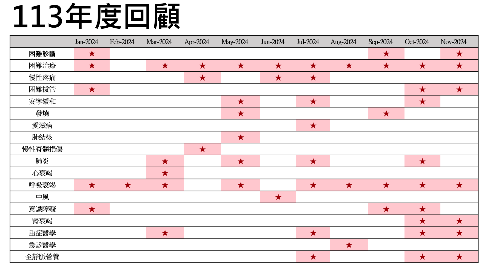

> 本頁由 LaTeX 原稿經 Pandoc 自動轉換，可能需少量人工微調。

# 背景

## 跨領域討論會在新竹的歷史

### 我們為什麼要編這本手冊

## 2024年度會議回顧

{#fig:enter-label width="75%"}

  **日期**   **團隊**                   **個案簡介與討論重點**
  ---------- -------------------------- -----------------------------------------------------------------------------------------------------------------------------------------------------------
  1/16       雲林台大分院跨領域團隊     38 歲女性，發生不明目擊的暈倒，持續 10 分鐘。
  2/20       生醫竹東呼吸照護病房團隊   66 歲女性，呼吸器依賴，轉至 RCW 接受呼吸訓練。
  3/19       雲林台大分院跨領域團隊     71 歲女性，過去兩週逐漸出現呼吸困難。 討論：冠心病合併心衰竭及肺炎的照護。
  4/16       生醫竹東護理之家團隊       38 歲男性，因脊椎壓迫導致下半身無知覺，無法行動，期望繼續復健治療。 討論：協助年輕脊髓損傷個案重建生活目標。
  5/21       雲林台大分院跨領域團隊     65 歲長期臥床男性，護理之家轉入急診，發現低血糖及低血氧，送入 ICU。X-ray 顯示右側肋膜積水。 討論：確定診斷為結核病 (TB)，護理之家照護重點及 TB 診斷困難。
  6/18       神骨復影醫個案討論團隊     72 歲男性，2023 年 10 月 9 日罹患右側橋腦中風，住院期間病人主訴雙側肩膀與雙側膝蓋疼痛，術後仍有關節疼痛。 討論：中風後合併關節疼痛的全人照護。
  7/16       雲林台大分院跨領域團隊     71 歲男性，定期進行愛滋病治療，新診斷膽管癌，住院化療後合併肺動脈栓塞。
  8/20       急診醫學部跨領域團隊       64 歲女性，機車事故，胸口撞擊龍頭，呼吸困難及胸痛。 討論：急診插管病人是否需要鎮靜藥物使用？
  9/24       雲林台大分院跨領域團隊     68 歲男性，失智症、第二型糖尿病、癲癇及高血脂，發燒持續一天。 討論：疱疹病毒性腦炎 (HSV 腦炎) 的診斷與治療。
  10/15      生醫竹北加護病房團隊       56 歲男性，腹痛三天內進展至多重器官衰竭。 討論：重症胰臟炎的診斷與治療困難。
  11/19      雲林台大分院跨領域團隊     42 歲男性，腹痛及嘔吐 10 天，急診懷疑腸阻塞。 討論：急性腸缺血診斷與治療，個案為腸道靜脈栓塞所致腸缺血 (較少見)。

## 年度回顧與檢討

本年度的跨院跨領域討論會涵蓋了多種不同類型的臨床個案，從急診處置、加護病房管理、慢性病照護到中風與復健，顯示了不同醫療單位的合作與臨床思維交流。未來可持續優化病人轉介流程、提升診斷準確性，以及加強各職類間的協作與溝通。

## 表格範例- 心衰竭用藥

  -------------------------------------------------------------------------------------------------------------------------------------------------
  **藥物**                                                                       **優點**                 **副作用**
  ------------------------------------------------------------------------------ ------------------------ -----------------------------------------
  **Beta-Blockers**                                                              \- 減緩心跳\             \- 心跳過慢\
                                                                                 - 減少心肌耗氧量\        - 氣管收縮
                                                                                 - 降低心肌重塑           

  **Statins**                                                                    \- 降血脂\               \- 肝功能指數異常\
                                                                                 - 減少動脈粥狀硬化       - 肌肉疼痛

  **Angiotensin Converting Enzyme Inhibitors / Angiotensin Receptor Blockers**   \- 血管舒張\             \- 高血鉀\
                                                                                 - 降低心肌重塑           - 初期 eGFR 下降

  **Angiotensin Receptor-Neprilysin Inhibitor**                                  \- 血管舒張\             \- 高血鉀\
                                                                                 - 降低心肌重塑           - 初期 eGFR 下降

  **Mineralocorticoid Receptor Antagonists**                                     \- 減少鈉離子、水滯留\   \- 高血鉀\
                                                                                 - 降低心肌重塑           - 男性女乳症

  **SGLT-2 Inhibitors**                                                          \- 保護心臟、腎臟        \- 泌尿道感染\
                                                                                                          - 初期 eGFR 下降

  **Loop Diuretics**                                                             \- 增加水排除            \- 電解質異常（低血鉀、低血鎂、低血鈣）
  -------------------------------------------------------------------------------------------------------------------------------------------------
