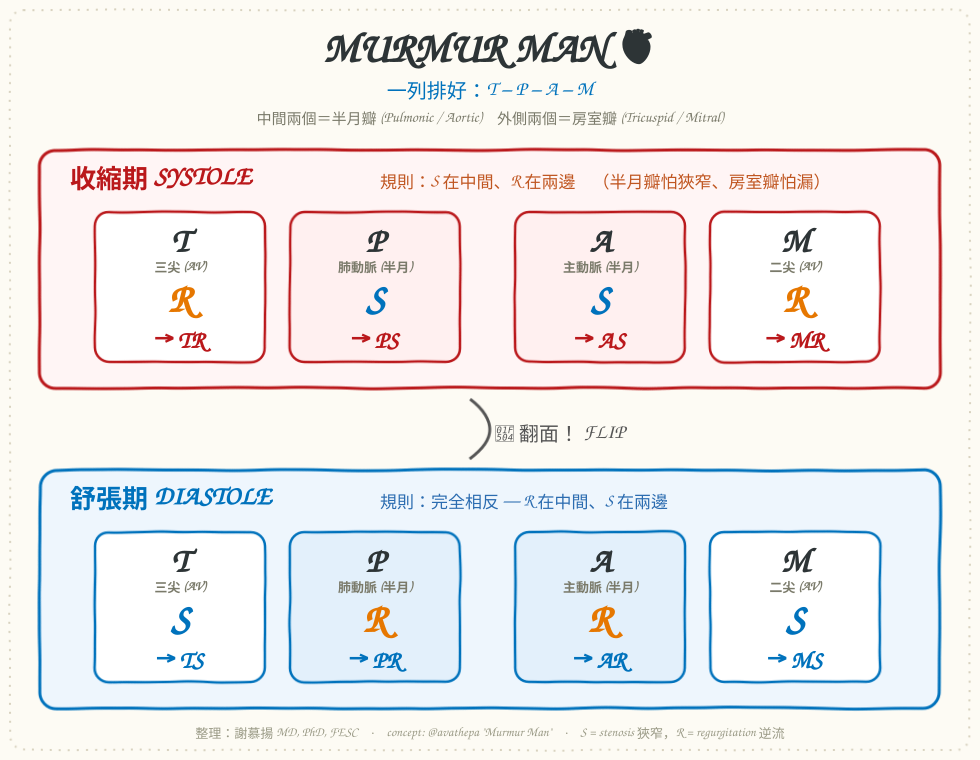

# Murmur Man — 一張圖記住所有心雜音 / Cardiac Murmurs Mnemonic

**整理：謝慕揚 MD, PhD, FESC**
**日期：2026-07-11**
**原文出處：[Instagram Reel — @avathepa, "Murmur man! My FAVORITE!"](https://www.instagram.com/reel/DZapy5zpivR/)**

> 這份共筆整理自 IG 教育帳號 **@avathepa** 的一則熱門教學短片（1.8 萬讚）。
> 該影片的旁白與手繪圖無法逐格擷取，但其教的正是心臟聽診界經典的
> **「Murmur Man」視覺助記法**（等同於社群流傳的 *TPAM / SS-RR* 法）。
> 本共筆把這套邏輯完整重建、補上臨床特徵與動作學，方便自學與教學。

---

## 目錄

1. [核心洞見：一個生理原則搞定全部](#1-核心洞見一個生理原則搞定全部)
2. [Murmur Man 怎麼畫](#2-murmur-man-怎麼畫)
3. [完整雜音分類表](#3-完整雜音分類表)
4. [八大雜音臨床特徵速查](#4-八大雜音臨床特徵速查)
5. [動作學：用手法把雜音「調大調小」](#5-動作學用手法把雜音調大調小)
6. [常見易混淆點](#6-常見易混淆點)
7. [30 秒自我測驗](#7-30-秒自我測驗)
8. [縮寫對照表](#8-縮寫對照表)
9. [參考資料](#9-參考資料)

---

## 1. 核心洞見：一個生理原則搞定全部

不要背 8 個雜音，只要記住**心動週期裡每個瓣膜「該開還是該關」**，雜音就自動推出來。

> **黃金原則**
> 雜音 = 血流「該通的時候不通」或「該關的時候在漏」。
> - **半月瓣 (aortic/pulmonic)**：收縮期該**開** → 若**狹窄 (stenosis)** 就在**收縮期**吵。
> - **房室瓣 (mitral/tricuspid)**：收縮期該**關** → 若**逆流 (regurgitation)** 就在**收縮期**吵。
> - 舒張期一切相反。

換句話說：

| 時相 | 半月瓣 (A/P) 狀態 | 房室瓣 (M/T) 狀態 | 會吵的病灶 |
|------|------------------|------------------|-----------|
| **收縮期 Systole** | 該開 → 怕狹窄 | 該關 → 怕逆流 | **AS, PS**（狹窄）＋ **MR, TR**（逆流） |
| **舒張期 Diastole** | 該關 → 怕逆流 | 該開 → 怕狹窄 | **AR, PR**（逆流）＋ **MS, TS**（狹窄） |

這就是 Murmur Man「令人信賴 (in murmur man we trust)」的原因——**它把上面那張表畫成一個人，一眼記住**。

---

## 2. Murmur Man 怎麼畫

把四個瓣膜依 **T – P – A – M** 排成一列（記成一個小人）：

```text
     外側        中間        中間        外側
    ┌─────┐   ┌─────┐   ┌─────┐   ┌─────┐
    │  T  │   │  P  │   │  A  │   │  M  │
    │三尖 │   │肺動脈│   │主動脈│   │二尖 │
    └─────┘   └─────┘   └─────┘   └─────┘
     房室瓣    半月瓣    半月瓣    房室瓣
```

- **中間兩個 = 半月瓣 (Pulmonic, Aortic)**
- **外側兩個 = 房室瓣 (Tricuspid, Mitral)**

接著套「SS / RR」規則：

```text
收縮期 SYSTOLE：中間放 S（stenosis）、兩側放 R（regurgitation）
        T        P        A        M
        R        S        S        R
       TR       PS       AS       MR   ← 收縮期雜音

舒張期 DIASTOLE：整個翻面 —— 中間放 R、兩側放 S
        T        P        A        M
        S        R        R        S
       TS       PR       AR       MS   ← 舒張期雜音
```

> **一句話記法**：
> 「收縮期 **S 在中間、R 在兩邊**；舒張期**完全相反**。」
> （英文助記：*Systolic = SS inside, RR outside；Diastolic = flip it.*）

左心（A、M）病灶臨床上遠比右心（P、T）常見，所以實務上先熟 **AS / MR（收縮期）** 與 **AR / MS（舒張期）** 這四個即可覆蓋 90% 情境。

<p align="center">
  
</p>

> **看圖記憶**：上排紅色是收縮期（S 在中間、R 在兩邊）；下排藍色是舒張期，把上排「翻面」即可。

---

## 3. 完整雜音分類表

| 病灶 | 中文 | 時相 | 最佳聽診區 | 傳導方向 | 典型音質 |
|------|------|------|-----------|---------|---------|
| **AS** | 主動脈瓣狹窄 | 收縮期 (crescendo-decrescendo) | 右上胸骨緣 (2nd RICS) | 傳向頸動脈 | 粗糙噴射音 |
| **MR** | 二尖瓣逆流 | 收縮期 (holosystolic) | 心尖 (apex) | 傳向左腋下 | 吹風樣 blowing |
| **PS** | 肺動脈瓣狹窄 | 收縮期 (crescendo-decrescendo) | 左上胸骨緣 (2nd LICS) | 傳向左鎖骨 | 噴射音 |
| **TR** | 三尖瓣逆流 | 收縮期 (holosystolic) | 左下胸骨緣 (LLSB) | 隨吸氣增強 | 吹風樣 |
| **AR** | 主動脈瓣逆流 | 舒張早期 (decrescendo) | 左下胸骨緣 (Erb's point) | — | 高頻嘆氣樣 |
| **PR** | 肺動脈瓣逆流 | 舒張早期 (decrescendo) | 左上胸骨緣 | — | 高頻（Graham Steell） |
| **MS** | 二尖瓣狹窄 | 舒張中晚期 (低頻隆隆聲) | 心尖（左側臥、鐘面） | 不傳導 | opening snap + rumble |
| **TS** | 三尖瓣狹窄 | 舒張期 (rumble) | 左下胸骨緣 | 隨吸氣增強 | 低頻隆隆聲 |

> **右心雜音鐵律**：**吸氣時變大 (Carvallo's sign)** → 想到 TR / TS / PS / PR。
> **左心雜音**吸氣時通常不變或略減。

---

## 4. 八大雜音臨床特徵速查

### 收縮期 (Systolic)

- **AS 主動脈瓣狹窄**：老年退化最常見；三聯徵 **胸痛、暈厥、心衰**；脈搏 *parvus et tardus*（弱而遲）；S2 減弱。
- **MR 二尖瓣逆流**：全收縮期、心尖、傳左腋下；可伴 S3；急性 MR（腱索斷裂、乳頭肌破裂）→ 急性肺水腫。
- **PS 肺動脈瓣狹窄**：多為先天性；左上胸骨緣噴射音 + ejection click。
- **TR 三尖瓣逆流**：多為功能性（右心/肺高壓續發）；頸靜脈 **大 v 波**、搏動性肝臟。

### 舒張期 (Diastolic)

- **AR 主動脈瓣逆流**：脈壓大、bounding pulse；週邊徵象多（Corrigan、de Musset、Quincke）；坐起前傾、吐氣末聽最清楚。
- **PR 肺動脈瓣逆流**：常續發於肺高壓（Graham Steell murmur）。
- **MS 二尖瓣狹窄**：多為風濕性；**opening snap** 後接低頻舒張期隆隆聲；心房顫動與栓塞風險。
- **TS 三尖瓣狹窄**：少見，常與 MS 併存（風濕性）。

---

## 5. 動作學：用手法把雜音「調大調小」

床邊區分雜音的關鍵——改變**前負荷 / 後負荷**看雜音怎麼變。

| 手法 | 生理改變 | 變大的雜音 | 變小的雜音 |
|------|---------|-----------|-----------|
| **吸氣 (inspiration)** | ↑ 右心回流 | 所有**右心**雜音 (TR, TS, PS, PR) | — |
| **吐氣 / 握拳 handgrip** | ↑ 後負荷 (afterload) | **MR、AR、VSD** | **AS、HOCM** |
| **Valsalva 用力 / 站立** | ↓ 前負荷 (preload) | **HOCM、MVP** | 幾乎所有其他雜音 |
| **蹲下 squatting** | ↑ 前負荷＋後負荷 | 幾乎所有其他雜音 | **HOCM、MVP** |
| **passive leg raise** | ↑ 前負荷 | 多數雜音 | HOCM |

> **兩個「叛逆分子」HOCM 與 MVP**：
> 別的雜音靠**前負荷變大**（心室裝越滿越吵），這兩個相反——
> **前負荷↓（Valsalva、站立）反而變大**，因為心室越空，阻塞/脫垂越明顯。
> 記法：**「站起來變大 → HOCM/MVP；蹲下去變大 → 其他大家」**。

---

## 6. 常見易混淆點

- **AS vs MR**：兩者都在收縮期、都在左心。差別——AS 是 *crescendo-decrescendo*（有形狀、傳頸動脈）；MR 是 *holosystolic*（一片平、傳左腋下）。**握拳 handgrip**：MR↑、AS↓ 可立刻分家。
- **AR vs MS**：都在舒張期。AR 是**舒張早期**高頻嘆氣（decrescendo）；MS 是**舒張中晚期**低頻隆隆 + opening snap。
- **HOCM 常被當成 AS**：都在收縮期左心。關鍵——**Valsalva 讓 HOCM 變大、讓 AS 變小**；且 HOCM 不太傳頸動脈。
- **「Innocent / 生理性雜音」**：柔和 (≤2/6)、收縮期、無傳導、無症狀、姿勢改變會消失——不需處置。

---

## 7. 30 秒自我測驗

先遮住答案，用 Murmur Man 推推看：

1. 收縮期、心尖、傳左腋下、握拳變大 → ?
2. 舒張早期、坐起前傾最清楚、脈壓大 → ?
3. 收縮期、右上胸骨緣、傳頸動脈、脈搏弱而遲 → ?
4. 舒張中期、心尖、opening snap、心房顫動 → ?
5. 收縮期、Valsalva 變大、不傳頸動脈 → ?
6. 收縮期、左下胸骨緣、**吸氣變大** → ?

<details>
<summary>解答</summary>

1. **MR**　2. **AR**　3. **AS**　4. **MS**　5. **HOCM**（非瓣膜，但常考）　6. **TR**
</details>

---

## 8. 縮寫對照表

| 縮寫 | 全名 | 中文 |
|------|------|------|
| AS | Aortic Stenosis | 主動脈瓣狹窄 |
| AR | Aortic Regurgitation (Insufficiency) | 主動脈瓣逆流 |
| MS | Mitral Stenosis | 二尖瓣狹窄 |
| MR | Mitral Regurgitation | 二尖瓣逆流 |
| PS | Pulmonic Stenosis | 肺動脈瓣狹窄 |
| PR | Pulmonic Regurgitation | 肺動脈瓣逆流 |
| TS | Tricuspid Stenosis | 三尖瓣狹窄 |
| TR | Tricuspid Regurgitation | 三尖瓣逆流 |
| MVP | Mitral Valve Prolapse | 二尖瓣脫垂 |
| HOCM | Hypertrophic Obstructive Cardiomyopathy | 肥厚性阻塞型心肌病變 |
| VSD | Ventricular Septal Defect | 心室中隔缺損 |
| RICS / LICS | Right / Left Intercostal Space | 右／左肋間 |
| LLSB | Left Lower Sternal Border | 左下胸骨緣 |

---

## 9. 參考資料

1. 原始貼文：@avathepa. *"Murmur man! My FAVORITE!"* [Instagram Reel.](https://www.instagram.com/reel/DZapy5zpivR/)
2. Systolic and diastolic murmurs (mnemonic). [*Radiopaedia*.](https://radiopaedia.org/articles/systolic-and-diastolic-murmurs-mnemonic)
3. Heart Murmurs for the USMLE: Types, Mnemonics, and Diagnosis. [*King of the Curve*.](https://kingofthecurve.org/blog/usmle-heart-murmurs)
4. Heart murmurs mnemonic. [*Medicowesome*.](https://www.medicowesome.com/2015/09/heart-murmurs-mnemonic.html)
5. Dynamic auscultation manoeuvres — handgrip, Valsalva, squatting. 標準心臟物理診斷教材（Bates' Guide to Physical Examination；Harrison's Principles of Internal Medicine, Cardiovascular section）。

---

*本共筆整理自公開衛教短片內容，僅供醫療專業教學參考；臨床決策仍以完整病史、理學檢查與心臟超音波為準。*
