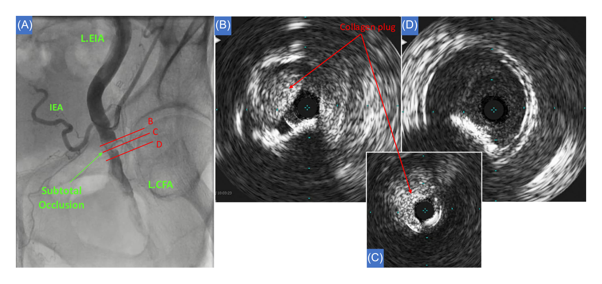
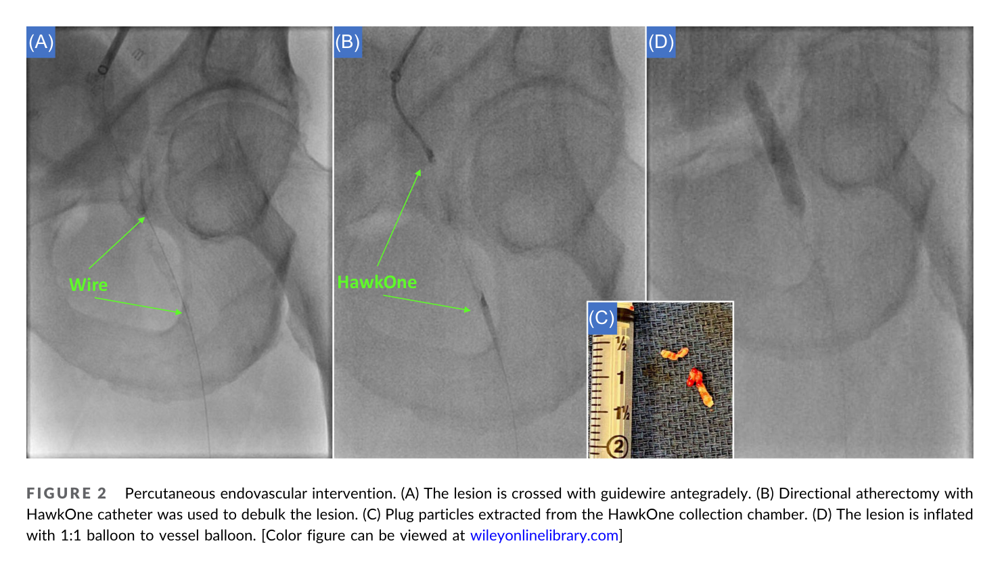
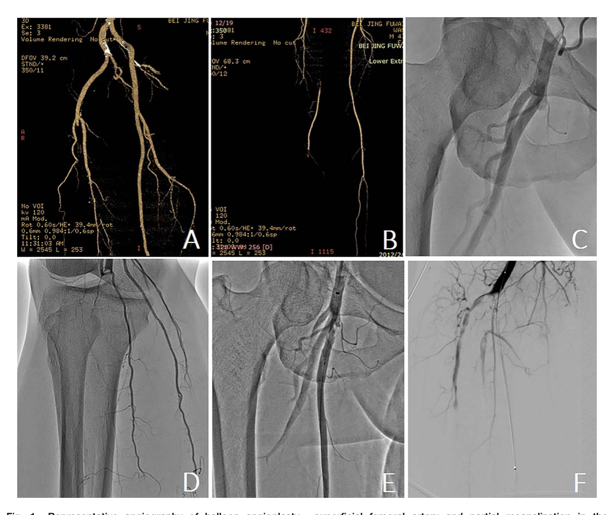
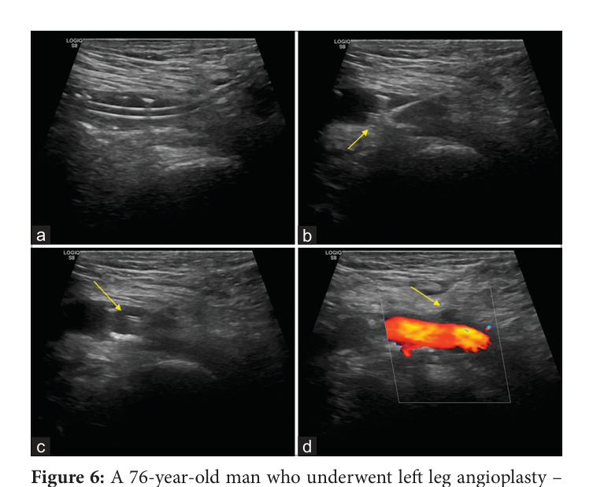
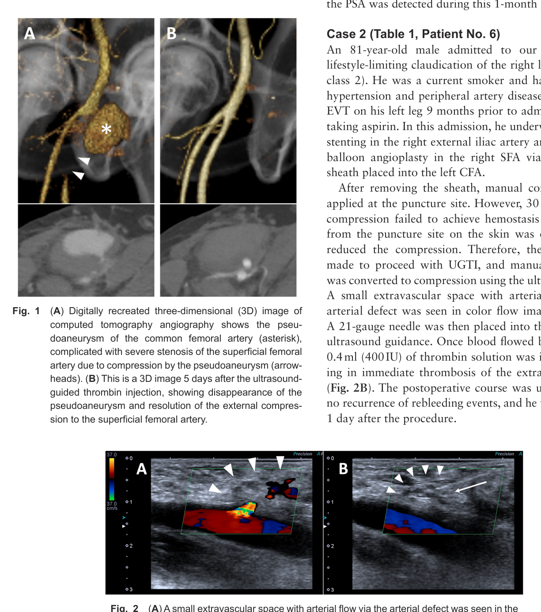
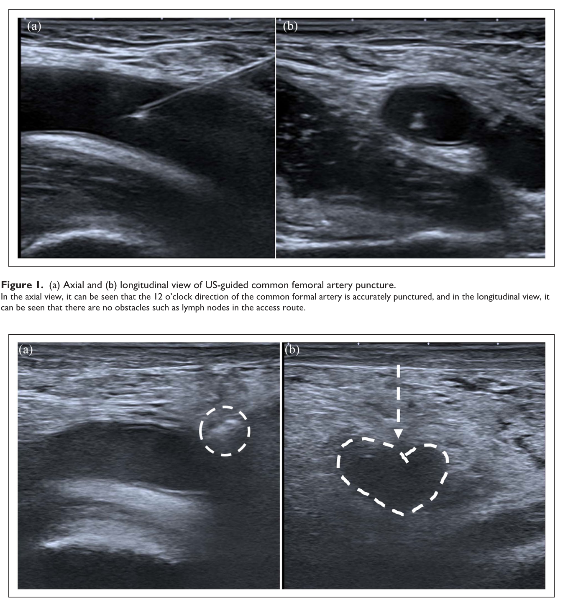
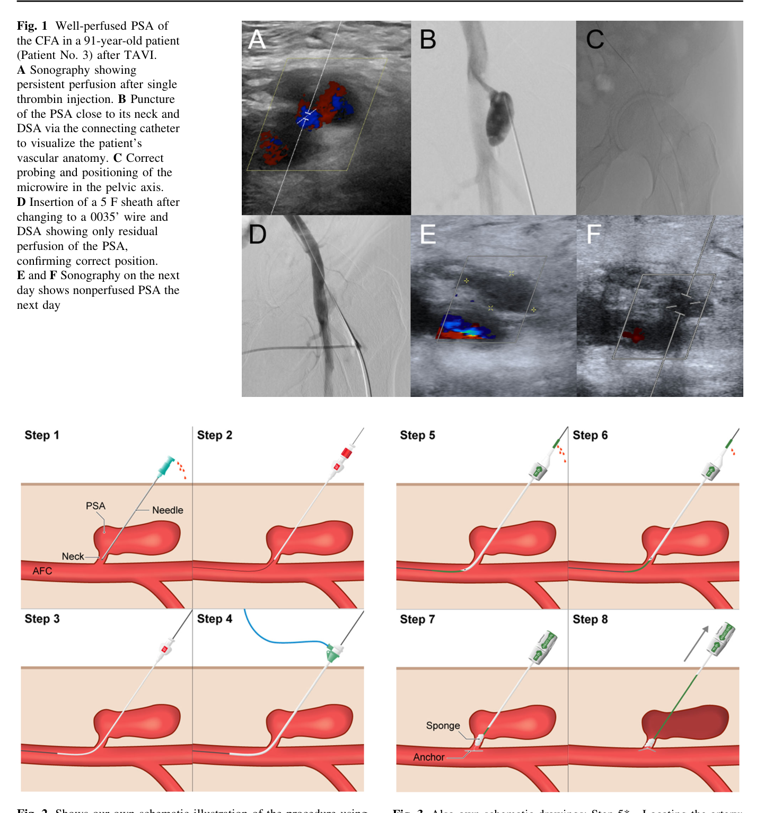
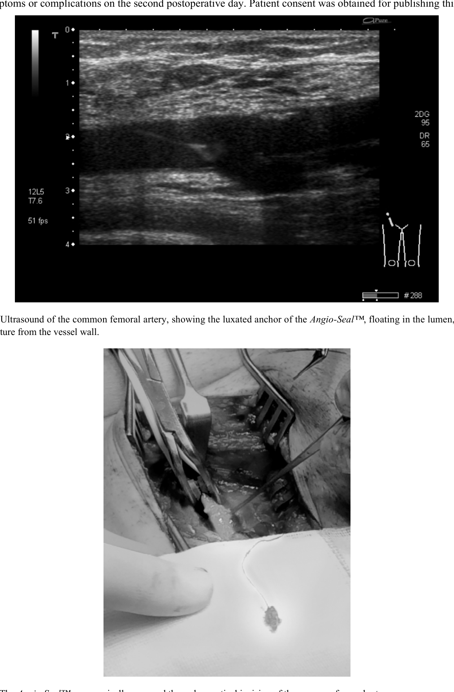

<!-- _class: lead -->
# AngioSeal 碰到困難怎麼處理？
## When AngioSeal Goes Wrong — Bail-out & Ultrasound Prevention
**研討會報告**
謝慕揚 MD, PhD, FESC ｜ 2026
[關鍵回顧：Shariq 2023, J Clin Imaging Sci](https://pubmed.ncbi.nlm.nih.gov/37810184/)

---

# 為什麼要談這題

- AngioSeal（collagen-plug 型 VCD）置放成功率 ~**98%**，但**失敗時併發症風險約 5 倍**
- 動脈阻塞／急性肢體缺血 (ALI) 雖罕見（~**0.3%**），卻可能**致殘、需手術**
- 本報告聚焦兩件事：
  1. **Bail-out**：困難／併發症當下怎麼救
  2. **超音波預防**：怎麼從一開始就避免掉進坑

> 核心觀念：**同一個敵人**貫穿全場——**穿刺處的鈣化斑塊**（前壁或後壁）

---

# AngioSeal 的三個元件 = 三個故障點

| 元件 | 正常功能 | 故障模式 |
|------|----------|----------|
| **錨片 (footplate/anchor)** | 動脈內壁定錨 | **栓塞**（脫落順血流）、**卡在鈣化斑無法回收** → 管腔內展開 |
| **膠原塞 (collagen plug)** | 動脈外止血 | **突入管腔** → 狹窄／阻塞；**感染巢** |
| **可吸收縫線 (suture)** | 夾合三明治 | 張力不足 → 錨片鬆脫漂浮 |

- 膠原塞約 **60–90 天**自行吸收 → 是「watchful waiting / 少放支架」的依據
- 機制核心：**後壁／前壁鈣化斑塊阻礙錨片回收**，footplate 在管腔內展開或脫落

---

# 誰容易失敗（風險因子）

- **血管條件**：總股動脈 (CFA) 嚴重鈣化／粥狀硬化、管徑小、周邊動脈疾病
- **穿刺**：低位（落 SFA/分叉）、antegrade、非 CFA
- **操作**：大號鞘、重複部署、長手術時間、抗凝
- **族群**：肥胖、糖尿病、高齡

> **Abando 法則**：血管 **<5 mm** 或穿刺處附近狹窄 **≥40%** → **不要用 AngioSeal**
> （感染風險 0.2–0.6%；ASCD 併發症 up to ~2.5%，多在鈣化血管）

---

<!-- _class: divider -->
# 流行病學與時間
## Epidemiology & Timing

---

# 失敗率與後果（Bangalore 2009, n=9823）

- VCD 失敗率 **2.7%**（診斷 2.3% vs PCI 3.0%）
- **失敗 → 血管併發症顯著上升**：

| 結果 | 失敗組 | 成功組 |
|------|--------|--------|
| 任何血管併發症 | **6.7%** | 1.4% |
| 主要併發症 | 1.9% | 0.6% |
| 肢體缺血 | 0.4% | 0.1% |
| 假性動脈瘤 | 0.7% | 0.1% |

> 配對後任何併發症 OR **5.63**。**失敗的 VCD 比單純手壓更危險** → 這些病人必須密切監測。
> 限制：僅院內結果，**晚發併發症被低估**（見下頁時間軸）

---

# 併發症的「時間軸」（Timing）

```text
 置放當下 ──────── 數小時–數天 ──────── 1–2 週 ──────── 數週–數月
  │                  │                    │                │
 部署失敗            急性肢體缺血          亞急性阻塞        晚發狹窄
 止血失敗/出血        (acute ALI)         錨片栓塞          (膠原塞吸收後)
                    冷腳、無脈            (可遲至 7 天才現)   跛行
 ── manual          ── 緊急 endovascular ── 影像追蹤        ── 球囊/atherectomy
```

- ALI 發作分布（Haberman, n=40）：**急性（同次住院）48% / 亞急性 <2 週 30% / 慢性 >2 週 22%**
- **中位診斷時間 13 天**；跛行 92%、ALI 65%；阻塞位置 **CFA 88%** / SFA 12%
- 錨片栓塞可**遲至 7 天**才以 ALI 表現（Shariq Case 1）

---

# 併發症全覽（Complications）

| 併發症 | 機制 | 處理主軸 |
|--------|------|----------|
| 急性肢體缺血／動脈阻塞 | 膠原塞突入＋鈣化斑 | **endovascular（atherectomy＋balloon）/ 手術** |
| 錨片栓塞 (footplate) | 脫落入 SFA/膕動脈 | 取出（forceps）/ 手術 |
| 晚發狹窄 | 局部纖維化 | 球囊／atherectomy |
| 假性動脈瘤 | 止血不全 | **超音波導引 thrombin/fibrin** |
| 出血／腹膜後出血 | 未達止血 | 壓迫、影像、輸血、介入 |
| 感染 | 膠原塞異物巢 | 抗生素＋外科清創/切除 |
| 部署失敗 | 錨片未坐穩 | 勿強拉 → manual / 補救裝置 |

---

<!-- _class: divider -->
# 困難處理流程
## The Bail-out Algorithm

---

<!-- _class: small-text -->
# 困難處理流程圖（Decision Tree）

```text
                         AngioSeal 困難 / 併發症
                                  │
        ┌─────────────┬───────────┼────────────────┬─────────────────┐
     部署困難        止血失敗/出血   急性缺血/阻塞 (ALI)   假性動脈瘤        錨片栓塞
        │              │              │                  │                 │
  超音波看 footplate   壓迫 +         對側 crossover       超音波導引         影像定位
  卡鈣化斑?           影像(RP?→CT)    + 遠端 EPD           thrombin 注射      錨片
        │              │             + directional        (首選, 85–100%)    │
  ➜ 旋轉 180°、        必要時          atherectomy 清膠原    │                endovascular
    退到斑塊遠端       介入/手術        + balloon (±stent)   neck<1cm/         forceps 取出
    再轉回中位                        ── 失敗→外科           defect>5mm/       或外科
  ➜ 不行就改           輸血            endarterectomy        感染/巨大 → 外科
    manual compression                + footplate 取出
```

> 兩條主軸：**動脈阻塞走 endovascular（atherectomy 為主力）**；**假性動脈瘤走超音波導引注射**。
> 外科保留給：endovascular 失敗、巨大/感染、錨片無法取出。

---

# Bail-out ①：部署當下的「旋轉手法」

**情境：** 部署時 footplate 卡在鈣化斑、阻力大、止血失敗（Shariq Fig 6）

- **超音波**確認 footplate 是否卡在前/後壁鈣化斑
- 手法：**將裝置旋轉 180°** → 緩緩回收，直到 footplate **越過斑塊遠端** → 再轉回中位
- 仍不行 → **不要硬拉**（會把錨片拉斷/拉進管腔）→ 改 **manual compression** 或補救裝置

> 預防＞補救：**部署前用超音波看清楚斑塊位置**，是這一步成敗關鍵

---

# Bail-out ②：急性缺血／阻塞 — Endovascular 主力

**Haberman 2024（n=40，ALI 0.32%）— 目前最佳實務 ⭐**
- 路徑：**對側 crossover**（100%）+ 遠端栓塞保護 **EPD 48%**
- **Directional atherectomy 88%**（HawkOne/TurboHawk）**清除膠原塞** + **balloon 100%** ± cutting balloon 13% ± stent 18%（IVUS 43%）
- 結果：**100% 成功、0 轉手術**；中位追蹤 244 天 **0 再介入**

**Dong 2017（n=32，ALI 0.29%）— balloon-first**
- Balloon 58% / +溶栓(urokinase) 29% / +stent 13%；**成功 96.9%**；狹窄 97.5%→23.9%；再狹窄 9.7%

> **支架要克制**：CFA 過髖關節有 **fracture 風險**；膠原塞會自溶 → 多數不需 stent。Cutting balloon 較適合**縫線型** VCD 阻塞。

---

<!-- _class: fig -->
# 影像｜阻塞的真面目：IVUS 上的膠原塞



> 血管攝影見 collagen plug remnant；IVUS 顯示**膠原塞幾乎堵住管腔＋鈣化結節**。來源：Haberman 2024, *Catheter Cardiovasc Interv*（教學用途）

---

<!-- _class: fig -->
# 影像｜Endovascular bail-out（atherectomy）



> (A) 導絲通過 (B) HawkOne directional atherectomy 清除膠原塞 (C) 取出的 plug 碎屑 (D) 球囊擴張。來源：Haberman 2024, *Catheter Cardiovasc Interv*（教學用途）

---

<!-- _class: fig -->
# 影像｜急性肢體缺血：CTA 與 DSA（治療前後）



> 3D-CTA 見 SFA 阻塞＋膝下血栓；DSA 球囊擴張前後（狹窄 97.5%→23.9%）。來源：Dong 2017, *Catheter Cardiovasc Interv*（教學用途）

---

# Bail-out ③：外科與錨片取出

- **外科** = endovascular 失敗、巨大/感染、錨片無法取出時的後盾
  - CFA endarterectomy ＋ **footplate 取出**（Shariq Case 3：取出完整裝置）
  - 導線無法通過 → **ilio-popliteal bypass**（Dong 1 例）
- **錨片栓塞／漂浮 (floating Angio-Seal)**
  - 外科：縱向動脈切開取出（Dettmers）
  - Endovascular：**Alligator Tooth Retrieval Forceps** 取出（文獻替代）

> 教學點：**裝置不是放完就沒事**——Dettmers 個案是出院前理學檢查聽到 **CFA 收縮期雜音**才發現！

---

# Bail-out ④：假性動脈瘤 — 超音波導引注射（首選）

**超音波導引 thrombin 注射 (UGTI)** — 現代標準，成功率高
- 成功率 **85–100%**（Kurzawski 首針 85%、重複後 100%；Ozawa 100%；pooled ~97.5%）；再發 ~3.3%、併發症 1.3%
- **技術**：21G 針、bovine thrombin 1000 U/mL；先注 **0.2 mL（200 U）**，看 color flow，殘流再加 0.1–0.2 mL；**終點＝囊內血流消失＋遠端動脈通暢**
- **不需停抗凝**也有效；務必全程看到針尖（避免打進動脈）

**超音波導引 fibrin glue (Gummerer)**：成功 87.3%、轉手術 12.7%、**遠端栓塞 4%**

---

<!-- _class: fig -->
# 影像｜假性動脈瘤的超音波（yin-yang）



> AngioSeal 後總股動脈假性動脈瘤；color-Doppler 見典型 yin-yang 血流。來源：Shariq 2023, *J Clin Imaging Sci*（open access）

---

<!-- _class: fig -->
# 影像｜超音波導引 thrombin 注射



> 3D-CTA 假性動脈瘤（星號）＋注射 5 天後消退；color-Doppler 見頸部血流，21G 針注入 0.4 mL（400 IU）thrombin。來源：Ozawa 2022, *Ann Vasc Dis*（open access）

---

# 假性動脈瘤：選擇與紅線（Cochrane + 共識）

- **Cochrane (Tisi 2013)**：壓迫為一線；**超音波導引壓迫並不優於盲壓**；壓迫失敗再用 thrombin。各別 RCT 偏好 thrombin，但**統合後未達顯著**（樣本小）
- **務實順序**：小（<2–3 cm）/無抗凝 → 觀察；其餘 → **UGTI**（最高成功率）
- **避免經皮注射、直接外科**：**neck <1 cm 或 defect >5 mm**、感染、皮膚壞死、破裂、巨大、AV fistula、肢體威脅

> 注意：Cochrane 指出**沒有任何 RCT 納入手術組**——「外科為金標準」缺乏 RCT 實證

---

<!-- _class: divider -->
# 超音波預防
## Ultrasound Prevention — 從源頭避免困難

---

# 預防 ①：超音波導引「穿刺」

**Foerschner 2022（n=479，導管電燒）⭐**
- 總血管併發症 **6.3% vs 10.7%**；**血腫 >5 cm** 2.5% vs 6.3%、**假性動脈瘤** 0.6% vs 3.8%
- **肥胖 (BMI>30) 獲益最大**（OR 0.138）；ACT 劑量無影響 → **穿刺品質 ＞ 抗凝控制**

**Skalidis 2025（n=231，周邊介入，全程 US 穿刺）**
- VCD 併發症低於 manual compression（**MC vs VCD OR 2.41**）；**穿刺處鈣化 OR 2.74**；collagen-plug 裝置失敗 **0%**

> **技術**：分辨動靜脈、在**分叉上方**穿刺、避開鈣化／後壁、即時看針尖

---

# 預防 ②：超音波導引「部署 / 止血」

**US-MANTA（Miyashita 2022, n=1150）** — 大號 VCD ⭐
- 超音波導引使**血管併發症 12.5%→6.8%（p=0.001）、裝置失敗 7.5%→3.9%（p=0.012）**；US-guided **OR 0.56**（0.36–0.88）
- 用**長軸**掃描定位 toggle、確認在 CFA 內、與前壁平行 ≥45° 再釋放
- US 也讓**裝置失敗能當下立刻辨識**

**US-guided 縫線止血（Kwak）** — 「heart-shape sign」
- 即時看 knot-trimmer 抵到**前壁**再剪線；止血時間 **256 vs 317 秒**、需補手壓 **7/54 vs 15/50**

> 超音波貫穿三階段：**穿刺 → 部署確認 → 止血確認**

---

<!-- _class: fig -->
# 影像｜超音波導引止血：heart-shape sign



> 上：US 導引總股動脈穿刺（軸切＋長軸）。下：knot-trimmer 抵前壁時動脈被壓成「心形」（b 箭頭）= 止血到位。來源：Kwak 2025, *J Vasc Access*（教學用途）

---

# 殘存的敵人：前壁鈣化（The Residual Enemy）

- 超音波**降低**但**無法完全克服**前壁鈣化造成的失敗
- **兩個世代一致**：嚴重鈣化時 US 的保護效益**消失**（Miyashita n=1150 **p-interaction 0.048**；Skalidis 鈣化 **OR 2.74**）
- 對策：
  - **長軸掃描**標定鈣化、避開前壁/側壁/分叉
  - 鈣化嚴重 → **改策略**（manual compression、改入路、或外科切開縫合）
  - 回到 **Abando 法則**：小血管/狹窄就**別硬上 AngioSeal**
- **永遠保留對側入路**作為 bail-out

---

# 反向思考：把問題變工具 — Transaneurysmal AngioSeal

**Auer 2023（n=14，多為 TAVI 後 CFA 假性動脈瘤）**
- 對**保守/壓迫/thrombin 失敗**的假性動脈瘤，用 AngioSeal **經瘤頸封閉**
- **關鍵手感**：locator 側孔出血由**噴射 → 涓滴 (spurt → trickle)** = 針尖已在瘤頸；再進 1–2 cm 入動脈、釋放錨片、把膠原塞拉進瘤頸
- **技術成功 100%、零併發症、無需手術**；隔日超音波確認囊內無血流、遠端正常

> AngioSeal 不只是「製造困難」的裝置，必要時也能**反過來成為 bail-out 工具**

---

<!-- _class: fig -->
# 影像｜Transaneurysmal AngioSeal 技術



> 上：US/DSA 經瘤頸定位與封閉（A–F）。下：Step 1–8 示意——穿刺瘤頸 → 導絲 → 鞘 → 釋放錨片 → 膠原塞拉入瘤頸封閉。來源：Auer 2023, *Cardiovasc Intervent Radiol*（教學用途）

---

<!-- _class: fig -->
# 影像｜漂浮的 Angio-Seal（floating anchor）



> 上：US 見管腔內漂浮的 luxated anchor（懸在縫線上）。下：手術取出的完整裝置。來源：Dettmers 2016, *Open Cardiovasc Med J*（open access）

---

<!-- _class: imgph -->
# 影像區（你自己的案例：請插入去識別化影像）

<div class="ph">

**建議放入的影像（對照文獻所示）：**
1. **超音波**：CFA 前/後壁鈣化斑；管腔內**echogenic footplate**；「漂浮錨片」；color-Doppler 假性動脈瘤 yin-yang
2. **IVUS**：膠原塞幾乎堵住管腔＋鈣化結節（Haberman Fig 1）
3. **DSA**：CFA 次全阻塞 pre → atherectomy/balloon post；錨片栓塞至膕動脈
4. **CTA**：focal CFA 阻塞、below-knee thrombosis
5. **你自己的案例**：困難部署、bail-out 過程、術後通暢的血管攝影／超音波

</div>

> （依你習慣：插入自己手術的去識別化 angiograph／US；本頁為版位占位）

---

# 代表性案例（Illustrative Cases）

- **Case A（Shariq C1）**：72F，DM/吸菸，footplate **栓塞至膕動脈支架**，**7 天後**才以 ALI 表現 → 溶栓＋**Supera 支架**，6 月通暢
- **Case B（Shariq C3）**：63F，腦血管攝影後**急性冷腳**、CFA 阻塞 → **外科 endarterectomy ＋ 取出 footplate**
- **Case C（Dettmers）**：63M，**完全無症狀**，出院前理學檢查聞 **CFA 收縮期雜音** → 超音波見漂浮錨片 → 擇期手術取出
- **Case D（Auer）**：TAVI 後假性動脈瘤，壓迫/thrombin 失敗 → **Transaneurysmal AngioSeal** 封閉成功

> 教學：**出院前聽診/觸診穿刺處**；早期辨識 = 保肢關鍵

---

# Take-home Algorithm

1. **預防**：Abando 法則篩選；**超音波導引穿刺**（分叉上、避鈣化）；部署前看清斑塊
2. **部署困難**：超音波看 footplate → **旋轉 180°** 解卡 → 不行就 manual，**別硬拉**
3. **急性缺血/阻塞**：對側 crossover ＋ EPD ＋ **directional atherectomy ＋ balloon**（Haberman）；支架克制；失敗→外科
4. **假性動脈瘤**：**超音波導引 thrombin**（85–100%）；neck<1cm/感染/巨大→外科
5. **錨片栓塞**：forceps 取出 / 外科
6. **永遠保留對側入路；出院前檢查穿刺處**

> 一句話：**鈣化是主因、超音波是預防、atherectomy 與 thrombin 是兩大 bail-out 主力。**

---

<!-- _class: small-text -->
# 參考文獻（已下載全文，PubMed 查證）

1. Shariq M, et al. Complications with Angio-Seal VCD and their management. [*J Clin Imaging Sci*. 2023;13:26.](https://pubmed.ncbi.nlm.nih.gov/37810184/)
2. Haberman D, et al. Percutaneous endovascular management of Angio-Seal related vascular occlusion. [*Catheter Cardiovasc Interv*. 2024;104(7):1461-8.](https://pubmed.ncbi.nlm.nih.gov/39463029/)
3. Dong H, et al. Endovascular therapy for Angio-Seal-related acute limb ischemia. [*Catheter Cardiovasc Interv*. 2017;89(S1):609-15.](https://pubmed.ncbi.nlm.nih.gov/28191744/)
4. Bangalore S, et al. Vascular closure device failure: frequency and implications. [*Circ Cardiovasc Interv*. 2009;2(6):549-56.](https://pubmed.ncbi.nlm.nih.gov/20031773/)
5. Dettmers RC, et al. A peculiar case of a floating Angio-Seal. [*Open Cardiovasc Med J*. 2016;10:44-7.](https://pubmed.ncbi.nlm.nih.gov/27053966/)
6. Auer TA, et al. Transaneurysmal occlusion of CFA pseudoaneurysms using Angio-Seal. [*Cardiovasc Intervent Radiol*. 2023;46(2):268-73.](https://pubmed.ncbi.nlm.nih.gov/36526800/)
7. Lai K, et al. Angio-Seal vs StarClose: systematic review and meta-analysis. [*PeerJ*. 2024;12:e18652.](https://pubmed.ncbi.nlm.nih.gov/39703921/)
8. Miyashita H, et al. Ultrasound-guided vs conventional MANTA deployment after TAVI (n=1150). [*Am J Cardiol*. 2022;180:116-23.](https://pubmed.ncbi.nlm.nih.gov/35933223/)
9. Foerschner L, et al. US-guided access reduces vascular complications. [*J Clin Med*. 2022;11(22):6766.](https://pubmed.ncbi.nlm.nih.gov/36431243/)
10. Kwak JW, Cho SB. Real-time US-guided hemostasis using suture-mediated closure. [*J Vasc Access*. 2025;26(1):228-33.](https://pubmed.ncbi.nlm.nih.gov/38053258/)
11. Kurzawski J, et al. US-guided thrombin injection for iatrogenic pseudoaneurysms. [*Adv Interv Cardiol*. 2021;17(4):376-80.](https://pubmed.ncbi.nlm.nih.gov/35126552/)
12. Ozawa H, et al. US-guided thrombin injection for postcath pseudoaneurysms. [*Ann Vasc Dis*. 2022;15(1):22-8.](https://pubmed.ncbi.nlm.nih.gov/35432654/)
13. Gummerer M, et al. US-guided fibrin glue injection for femoral pseudoaneurysms. [*Vasc Endovascular Surg*. 2020;54(6):497-503.](https://pubmed.ncbi.nlm.nih.gov/32552570/)
14. Tisi PV, Callam MJ. Treatment for femoral pseudoaneurysms (Cochrane). [*Cochrane Database Syst Rev*. 2013;(11):CD004981.](https://pubmed.ncbi.nlm.nih.gov/24293322/)
15. Skalidis I, et al. Ultrasound-guided femoral hemostasis in peripheral angioplasty: VCD vs manual compression. [*Medicina (Kaunas)*. 2026;62(1):28.](https://pubmed.ncbi.nlm.nih.gov/41597314/)

---

<!-- _class: lead -->
# 謝謝聆聽
## Q & A

**一句總結：** 鈣化是主因；**超音波**從穿刺到止血全程預防；
**directional atherectomy** 與**超音波導引 thrombin** 是阻塞與假性動脈瘤的兩大 bail-out 主力。

> 本投影片為研討會教學整理，供臨床討論，非臨床指引或正式醫囑。文獻全文已下載、PubMed 查證。
