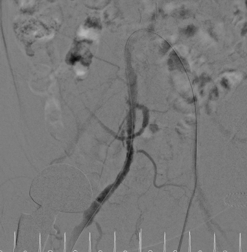
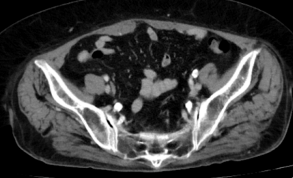

> 本頁由 LaTeX 原稿經 Pandoc 自動轉換，可能需少量人工微調。

::: center
**周邊血管介入病例討論**\
**Persistent Sciatic Artery: A Rare Vascular Anomaly**\
持續性坐骨動脈：罕見血管變異的診斷與處置\
新竹台大分院心血管中心病例\
整理：謝慕揚 MD, PhD, FESC 日期：\--
:::

::: tcolorbox
- 持續性坐骨動脈 (Persistent Sciatic Artery, PSA) 發生率僅 0.025-0.04%，極為罕見

- 本案為 82 歲女性（MRN: ***REDACTED***），右側 PSA，介入治療時器械位於 internal iliac artery 內

- PSA 動脈瘤發生率高達 48%，需特別注意血栓栓塞併發症

- 診斷關鍵：股動脈搏動減弱但膕動脈搏動正常、Cowie's sign（臀部搏動性腫塊）

- 治療策略需根據 Pillet-Gauffre 分類及是否合併動脈瘤決定
:::

# 病例呈現

## 基本資料

  **項目**         **內容**
  ---------------- ----------------------------------------------------------------------------------------------------
  患者             82 歲女性
  病歷號碼 (MRN)   ***REDACTED***
  診斷             Right-sided Persistent Sciatic Artery
  發現方式         周邊血管介入治療時發現
  關鍵發現         介入器械位於 internal iliac artery 內，而非一般的 external iliac $\rightarrow$ femoral artery 路徑
  操作醫師         潘恆宇醫師

## 影像學發現

<figure data-latex-placement="htbp">

<figcaption><strong>電腦斷層 (CT Axial)</strong> 
骨盆腔軸向切面，顯示 PSA 解剖位置</figcaption>
</figure>

::: importantbox
**血管攝影關鍵觀察點**：

從 angiography 不易直接辨識 PSA，需仔細觀察：

1.  導管及器械位置：本案器械皆位於 **internal iliac artery** 內

2.  正常情況下，下肢介入應經由 external iliac $\rightarrow$ common femoral $\rightarrow$ SFA 路徑

3.  PSA 從 internal iliac artery 延伸，經坐骨大孔至膕動脈
:::

# 持續性坐骨動脈概述

## 定義與流行病學

- **定義**：胚胎發育過程中坐骨動脈未正常退化，持續作為下肢主要血液供應

- **發生率**：0.025-0.04%（極為罕見）

- **性別分布**：男女比例接近（52.6% vs 47.4%）

- **雙側發生率**：約 26.3%

## 胚胎學

  **發育階段**   **說明**
  -------------- --------------------------------------------------
  胚胎早期       坐骨動脈是內髂動脈的延續，為下肢芽的主要血液供應
  胚胎第6-8週    股淺動脈 (SFA) 開始發育
  正常發育       SFA 與膕動脈建立連續性後，坐骨動脈退化
  正常殘餘       坐骨動脈殘餘形成膕動脈遠端及腓動脈
  PSA 形成       坐骨動脈未退化，持續作為下肢主要血供

## 解剖走向

PSA 從 internal iliac artery 發出，依序經過：

1.  梨狀肌 (piriformis muscle) 下方

2.  坐骨大孔 (greater sciatic foramen)

3.  沿坐骨神經 (sciatic nerve) 走行

4.  進入膕窩 (popliteal fossa)

5.  與膕動脈連續

::: tcolorbox
**介入治療重要提示**：由於 PSA 經由 internal iliac artery 供應下肢，介入器械會位於 internal iliac artery 內而非傳統的 external iliac $\rightarrow$ femoral artery 路徑。這是本病例的關鍵發現。
:::

# Pillet-Gauffre 分類系統

## 分類說明

此分類系統由 Pillet (1980) 提出，後由 Gauffre (1994) 修訂。

  **類型**   **描述**                              **臨床意義**
  ---------- ------------------------------------- --------------------------------
  Type 1     完整 PSA + 完整 SFA                   雙重血液供應，風險較低
  Type 2a    完整 PSA + 不完整 SFA                 **最常見 (62.5%)**，需特別注意
  Type 2b    完整 PSA + SFA 缺失                   下肢完全依賴 PSA，高風險
  Type 3     僅 PSA 近端存留 + 正常 SFA            風險相對較低
  Type 4     僅 PSA 遠端存留 + 正常 SFA            風險相對較低
  Type 5a    PSA 起源於中央薦動脈 + 發達 SFA       變異型
  Type 5b    PSA 起源於中央薦動脈 + 發育不全 SFA   需特別注意

## Ahn-Min 新分類與治療建議

  **新分類**   **對應 Pillet-Gauffre 類型**   **治療建議**
  ------------ ------------------------------ --------------
  Class I      Type 1, 5a                     保守治療為主
  Class II     Type 3, 4                      視症狀決定
  Class III    Type 2a, 2b, 5b                多需手術繞道
  Class IV     無法歸類                       個別化評估

# 臨床表現

## 症狀分布

- **無症狀偶然發現**：約 20%

- **有症狀**：約 80%

## 常見臨床表現

  **表現**         **發生率**   **說明**
  ---------------- ------------ --------------------------
  動脈瘤形成       25-58%       最常見併發症
  下肢缺血         31-63%       可能進展至重度缺血
  間歇性跛行       常見         **坐姿時加重**（特徵性）
  臀部搏動性腫塊   特異性       Cowie's sign
  坐骨神經症狀     可能         動脈瘤壓迫神經

## 特徵性臨床表現

::: importantbox
**Cowie's Sign**

- **定義**：臀部可觸及搏動性腫塊

- **臨床意義**：高度提示 PSA 存在

- **機制**：PSA 經過臀部皮下組織時可被觸及

**坐姿跛行 (Sitting Claudication)**

- **獨特表現**：患者坐下休息時反而出現跛行症狀

- **機制**：髖關節屈曲時，PSA 在梨狀肌與薦棘韌帶之間受壓

- **鑑別重點**：一般動脈阻塞性疾病休息時症狀緩解
:::

## 理學檢查要點

- 股動脈搏動減弱或消失

- 膕動脈搏動正常（來自 PSA）

- 臀部可能觸及搏動性腫塊

- 坐姿時下肢症狀可能加重

# 併發症

## 主要併發症

  **併發症**     **發生率**   **後果**
  -------------- ------------ --------------------
  動脈瘤         48%          血栓栓塞、破裂風險
  血栓栓塞       常見         急性下肢缺血
  狹窄           7%           慢性缺血
  PSA 阻塞       9%           嚴重缺血
  遠端動脈阻塞   6%           重度肢體缺血

## 嚴重後果

- **重度肢體缺血 (Critical Limb Ischemia)**：高達 25% 患者

- **截肢率**：8-10%

- **肢體喪失風險**：有動脈瘤者高達 60% 可能發生遠端栓塞

::: tcolorbox
由於 PSA 的解剖位置特殊（經過坐骨大孔、沿坐骨神經走行），動脈瘤形成後可能壓迫坐骨神經，造成類似坐骨神經痛的症狀，需與椎間盤疾病鑑別。
:::

# 診斷

## 影像學檢查

  **檢查方式**   **優點**                           **適應症**
  -------------- ---------------------------------- ------------------------
  CTA            首選，全景式成像，可評估解剖變異   所有疑似病例
  MRA            無輻射，無需碘造影劑               顯影劑過敏、腎功能不全
  DSA            金標準，可同時介入治療             計畫介入治療時
  都卜勒超音波   無創、可重複                       追蹤監測

## 血管攝影診斷要點

1.  下肢血流來自 internal iliac artery 而非 external iliac artery

2.  股淺動脈可能發育不全或缺失

3.  PSA 經坐骨大孔走行至膕窩

4.  介入器械位於 internal iliac artery 內（如本病例）

# 治療

## 治療原則

治療策略取決於：

- 解剖變異類型（Pillet-Gauffre 分類）

- 症狀嚴重程度

- 是否有動脈瘤

- 髂股動脈系統解剖

## 治療選項

  **情況**           **建議治療**
  ------------------ -----------------------------
  無症狀、無動脈瘤   保守觀察 + 定期超音波追蹤
  有症狀、無動脈瘤   藥物治療 $\pm$ 血管成形術
  有動脈瘤           手術繞道 $\pm$ 動脈瘤排除術
  急性缺血           取栓術 $\pm$ 繞道手術
  Class III/IV       多需繞道手術

## 手術方式

1.  **繞道手術 (Bypass Surgery)**

    - 股-膕動脈繞道

    - 使用自體大隱靜脈或人工血管

2.  **血管內治療 (Endovascular)**

    - 線圈栓塞 (Coil embolization)

    - 覆膜支架 (Stent graft)

3.  **混合手術 (Hybrid Procedure)**

    - 結合開放手術與血管內治療

# 學習重點

::: importantbox
**Clinical Pearls**

1.  **診斷線索**：股動脈搏動減弱但膕動脈搏動正常時，應考慮 PSA

2.  **Cowie's Sign**：臀部搏動性腫塊高度提示 PSA

3.  **坐姿跛行**：坐下時症狀加重而非緩解，為 PSA 特徵性表現

4.  **介入治療**：器械位於 internal iliac artery 內是重要診斷線索

5.  **動脈瘤風險**：高達 48%，需定期追蹤

6.  **雙側檢查**：一側發現 PSA 時，需檢查對側（雙側發生率 26%）

7.  **多專科合作**：血管外科、介入放射科、影像診斷專家共同評估
:::

# 本病例討論

- 本案為 82 歲女性（MRN: ***REDACTED***），右側 PSA，在周邊血管介入治療時發現

- 關鍵發現：介入器械皆位於 internal iliac artery 內

- 從血管攝影不易直接辨識，需仔細觀察器械位置

- CT 影像可清楚顯示 PSA 的解剖走向

- 此病例提醒我們在進行下肢血管介入時，若發現器械位置異常，應考慮血管變異的可能性

# 參考文獻

1.  Ahn S, Min SK. Treatment Strategy for Persistent Sciatic Artery and Novel Classification Reflecting Anatomic Status. [*Eur J Vasc Endovasc Surg*. 2016;52(3):360-369.](https://doi.org/10.1016/j.ejvs.2016.05.025)

2.  Kritpracha B, et al. Different Manifestations of Persistent Sciatic Artery and Possible Treatment Options: A Series of Four Cases. [*Diagnostics*. 2024;14(21):2383.](https://doi.org/10.3390/diagnostics14212383)

3.  Bower EB, et al. Persistent sciatic artery: embryology, pathology, and treatment. *J Vasc Surg*. 1993;18(2):242-248.

4.  van Hooft IM, et al. Persistent sciatic artery. [*J Vasc Surg*. 2010;51(4):1066.](https://doi.org/10.1016/j.jvs.2009.07.116)

5.  Paraskevas G, et al. Persistent sciatic artery: a systematic review. *Surg Radiol Anat*. 2015;37(10):1189-1195.

:::: center
::: {style="color: emergency_gray"}

------------------------------------------------------------------------
:::

\
*新竹台大分院心血管中心病例討論*\
病例提供：潘恆宇醫師\
整理：謝慕揚 MD, PhD, FESC
::::
