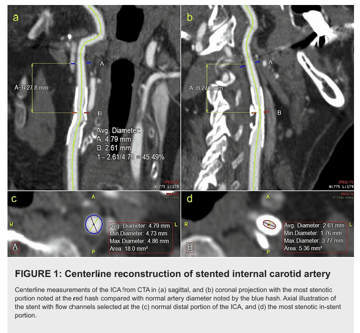
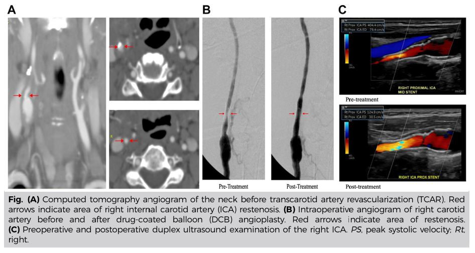

<!-- _class: lead -->

# 頸動脈支架之後的追蹤
## Post-Carotid Artery Stenting Surveillance

**謝慕揚 MD, PhD, FESC**
NTUH 新竹分院 心臟血管科

TSCI × TSOC Carotid Course 2026
2026-06-13 (Sat) 16:55–17:05 · 張榮發基金會 803 室
座長：黃啟宏 醫師

---

# 為何需要結構化追蹤？
## CAS 後的事件曲線

- **早期 (≤30 days)**：圍術期 stroke / MI / death — 風險最高
- **中期 (1-12 months)**：**neointimal hyperplasia → ISR**（in-stent restenosis 高峰期）
- **晚期 (>12 months)**：**stent fracture / late ISR / contralateral progression**
- 約 **5-10%** 患者於 follow-up 期間出現 ≥ 50% ISR

> **核心訊息**：CAS 之後的追蹤不是「形式」，而是分階段防禦不同的併發症。

<!-- _footer: TSCI × TSOC Carotid Course 2026 · Post-CAS Surveillance · 謝慕揚 -->

---

# 1. Surveillance schedule 對照
## AHA/SVS vs ESVS vs 台灣 NHI vs NTUH 慣例

| 時間點 | **SVS 2022**<sup>1</sup> | **ESVS 2023**<sup>2</sup> | **台灣 NHI** | **NTUH 慣例** |
|--------|-------------------------|---------------------------|-------------|--------------|
| 術後立即 | DUS 確認 patency | DUS baseline | 必做 | DUS baseline |
| **1 個月** | **DUS** (建議) | **DUS** | 視臨床 | **DUS + 神經學評估** |
| **6 個月** | **DUS** | **DUS** | 半年回診 | **DUS** |
| **12 個月** | **DUS** | **DUS** | 年度 DUS | **DUS + 影像 (if PSV ↑)** |
| 此後 | **每年 DUS** | **每年 (前 5 年)** | 年度 | 年度 / 視 ISR 風險 |

> **重點**：三大指引高度共識 — **1 / 6 / 12 個月 + 此後年度 DUS**。

<!-- _footer: 1. AbuRahma AF, J Vasc Surg 2022. 2. Naylor R, Eur J Vasc Endovasc Surg 2023. -->

---

# 2. 為何 DUS 是首選工具？
## Image surveillance hierarchy

- **DUS (duplex ultrasound)** — 第一線
  - 無輻射、可重複、便宜、可量化 (PSV / EDV / ICA-CCA ratio)
  - 缺點：operator dependence、stent artifact、calcification
- **CTA / MRA** — 第二線
  - DUS 異常時用以**確認 ISR 程度與長度**
  - 評估 stent fracture / contour（呂岳勳醫師專題）
- **DSA** — 第三線
  - 介入前確認 + 治療同步進行

> **三大指引**：除非 DUS 不可信，否則**不需例行 CTA/MRA 追蹤**。

<!-- _footer: ESVS 2023 Class I, Level C. -->

---

# 3. PSV cut-off post-stent
## 與 native ICA 不同 — 不可直接套用 native criteria

| 殘餘狹窄 / ISR 程度 | **PSV (cm/s)** | **ICA/CCA ratio** | 來源 |
|---------------------|---------------|-------------------|------|
| ≥ 20% 殘餘 | ≥ 150 | ≥ 2.15 | Lal 2008<sup>3</sup> |
| **≥ 50% ISR** | **≥ 220** *(or 170)* | **≥ 2.7** | Lal 2008 / Chi 2007 |
| ≥ 70% ISR | ≈ 300 | — | Chi 2007 |
| **≥ 80% ISR (high-grade)** | **≥ 340** | **≥ 4.15** | Lal 2008 |

> Native ICA criteria (PSV ≥ 230 = 70%) **會高估** stented artery 的狹窄程度。
> **臨床操作**：詳細圖表請參考葉馨喬醫師 13:30 講題。

<!-- _footer: 3. Lal BK, J Vasc Surg 2008;47(1):63-73. https://doi.org/10.1016/j.jvs.2007.09.038 -->

---



<!-- _footer: 'Figure: Bitsko LJ et al. *Cureus* 2022;14(7):e26700. CC BY 4.0. CTA centerline reconstruction of stented ICA — normal distal ICA (blue hash) vs most stenotic in-stent segment (red hash). https://doi.org/10.7759/cureus.26700' -->

---

<!-- _class: small-text -->

# 4. NTUH 自家 Case
## 無症狀 in-stent restenosis 的偵測與決策

<div style="font-size: 0.72em;">

**Case 摘要**（NTUH 新竹分院）：**74-y-o 男性**，CAD + DM + HTN；2024-08 因左側暫時性失明 → 左側 CAS（80% symptomatic stenosis, closed-cell stent）；規律 DAPT 6 個月 → 改 SAPT (clopidogrel)。

**Follow-up 時間軸**：

| 時間 | DUS PSV (cm/s) | EDV | ICA/CCA | 臨床 |
|------|----------------|-----|---------|------|
| 術後 1m | 105 | 30 | 1.8 | 無症狀 |
| 術後 6m | 145 | 45 | 2.3 | 無症狀 |
| **術後 12m** | **285** | **95** | **3.4** | **無症狀** |

</div>

> **問題**：要不要介入？

<!-- _footer: 案例為教學示範用，已 de-identified。 -->

---

# 5. 決策樹：無症狀 ISR 何時介入？

```text
DUS 提示 ≥ 50% ISR
       │
       ▼
   CTA 確認 (排除 artifact)
       │
   ┌───┴───┐
   ▼       ▼
 50-69%   ≥ 70%
   │       │
   ▼       ▼
 加強 SAPT  介入考量
 + DUS 3m   ├── re-CAS (DCB > 再放支架)
 監測       ├── 外科 revision (high-grade,
            │   stent fracture, 鈣化重)
            └── 觀察 (asymptomatic, surgical risk)
```

> **ESVS 2023 Class IIa**：asymptomatic ≥ 70% ISR + 預期壽命 > 5y → 考慮 re-intervention。

<!-- _footer: 細部 stent fracture 處理 → 陳盈憲醫師 16:30 講題。 -->

---

# 6. 本 case 的處理
## NTUH 新竹經驗

- **2025-08 (術後 12m)**：CTA 確認 left ICA in-stent **75% restenosis**, 長度 18 mm, 無 fracture
- **抉擇**：
  - ☑ Re-CAS with **DCB (drug-coated balloon)** — 避免 stent-in-stent 後續監測困難
  - ☐ Stent-in-stent — 保留為 DCB 失敗時 bailout
  - ☐ CEA revision — 高齡、頸部手術後沾黏風險高
- **結果**：DCB 成功 (paclitaxel-coated, 6×40 mm)，術後 PSV 130 cm/s，1 年後仍 patent
- **後續追蹤**：6m DUS → 之後年度

> **Pearl**：ISR 後優先 DCB，保留 stent-in-stent 作為 bailout。

<!-- _footer: NTUH Hsinchu CAS cohort（資料整理中）。 -->

---



<!-- _footer: 'Figure: Three-modality illustration of post-CAS ISR + DCB. (A) CTA — right ICA in-stent restenosis (arrows). (B) Intraoperative angiography before/after DCB. (C) DUS before/after DCB. CC BY 4.0.' -->

---

# 7. DAPT 持續時間：2025-2026 新證據
## Aspirin + Clopidogrel 要用多久？

| 研究 | n | 設計 | 主要發現 |
|------|---|------|---------|
| **Yoo 2025** *Stroke*<sup>4</sup> | **12,034** | 韓國 nationwide cohort (2007-2019) | Short DAPT (90d–6m) **不劣於** Long DAPT (≥6m)<br>Composite event 2.5% vs 2.1%, HR 0.87, **p = 0.337** |
| **Nguyen 2024** *Ann Vasc Surg*<sup>5</sup> | 279 | 20 年單中心 | Clopidogrel < 6 wk vs > 6 wk **ISR 率相同** (5.0% vs 9.2%, p = 0.17) |
| **Nakagawa 2025** review<sup>6</sup> | — | Narrative review | Asian 族群 clopidogrel resistance ~ 20% → 考慮 cilostazol 加強 |
| **CHET trial** (NCT06276374)<sup>7</sup> | 1,556 (目標) | **HBR RCT 進行中** | 30d DAPT → SAPT vs 12m DAPT，2030 完成 |

> **趨勢**：**3-6 個月 DAPT** 對多數患者已足夠；HBR 患者可考慮更短（CHET 結果待出）。

<!-- _footer: 4. Yoo J, Stroke 2025;56(3):613-620. 5. Nguyen T, Ann Vasc Surg 2024;103:68-73. 6. Nakagawa I, J Neuroendovasc Ther 2025. 7. Kim HJ, Am Heart J 2026. -->

---

# 8. DAPT De-escalation 實務建議
## 把握三個決策節點

<div style="font-size: 0.92em;">

| 時間點 | 評估 | 決策 |
|-------|------|------|
| **術後 30 天** | Periprocedural events 完全排除 | 確認 DAPT 順從性、bleeding history |
| **術後 90 天** | **DUS baseline + 出血風險再評估** | 一般風險：考慮 **降為 SAPT (clopidogrel)** |
| 術後 180 天 | DUS 6-month | 高風險 (DM, multi-vessel, contralateral disease) 可至此再降階 |

**特殊族群調整**：
- **HBR (BARC > 2)** — 等 CHET 結果；目前可考慮 30-90 d DAPT
- **AF + CAS** — DOAC + clopidogrel × 1-3 個月 → DOAC 單藥
- **Asian + clopidogrel resistance** — 加 cilostazol 100 mg BID 或換 ticagrelor

</div>

> 用藥不是「越久越好」— **延長 DAPT ↑ 出血風險而 ISR 無顯著差異**。

<!-- _footer: HBR = High Bleeding Risk; BARC = Bleeding Academic Research Consortium. -->

---

# 9. Take-Home Messages
## 5 條給 cath lab 同事

1. **三大指引共識追蹤節奏**：DUS at **1 / 6 / 12 個月 + 此後年度**
2. **Post-stent PSV criteria 與 native 不同**：≥ 220 cm/s 提示 ≥ 50% ISR；≥ 340 cm/s 提示 ≥ 80% ISR
3. **無症狀 ISR ≥ 70%** 且預期壽命 > 5y → 考慮 re-intervention；**DCB 為首選**
4. **DAPT 3-6 個月**對多數患者足夠 (Yoo 2025 nationwide cohort)
5. **HBR 患者**個別化：等 CHET trial 結果 (2030)；目前可考慮 30-90d 後降階

## 💬 Discussion Questions

1. **無症狀 in-stent restenosis 何時介入？** 70% 是絕對 cutoff 嗎？
2. **DAPT 何時降為 SAPT？** HBR 患者如何個別化調整？

<!-- _footer: 課後網站將同步 Q&A 與最新文獻。 -->

---

<!-- _class: ref -->

# 參考文獻

1. AbuRahma AF, Avgerinos ED, Chang RW, et al. Society for Vascular Surgery clinical practice guidelines for management of extracranial cerebrovascular disease. [*J Vasc Surg.* 2022;75(1S):4S-22S.](https://doi.org/10.1016/j.jvs.2021.04.073) [PMID: 34153348](https://pubmed.ncbi.nlm.nih.gov/34153348/)

2. Naylor R, Rantner B, Ancetti S, et al. European Society for Vascular Surgery (ESVS) 2023 Clinical Practice Guidelines on the Management of Atherosclerotic Carotid and Vertebral Artery Disease. [*Eur J Vasc Endovasc Surg.* 2023;65(1):7-111.](https://doi.org/10.1016/j.ejvs.2022.04.011) [PMID: 35598721](https://pubmed.ncbi.nlm.nih.gov/35598721/)

3. Lal BK, Hobson RW 2nd, Tofighi B, et al. Duplex ultrasound velocity criteria for the stented carotid artery. [*J Vasc Surg.* 2008;47(1):63-73.](https://doi.org/10.1016/j.jvs.2007.09.038) [PMID: 18178455](https://pubmed.ncbi.nlm.nih.gov/18178455/)

4. Yoo J, Lim H, Seo KD. Optimal Duration of Dual Antiplatelet Therapy After Carotid Artery Stenting: A Nationwide Cohort Study. [*Stroke.* 2025;56(3):613-620.](https://doi.org/10.1161/STROKEAHA.124.048743) [PMID: 39818984](https://pubmed.ncbi.nlm.nih.gov/39818984/)

5. Nguyen T, Jokisch C, Dargan C, et al. The Effects of Clopidogrel Duration on Carotid Artery In-Stent Restenosis. [*Ann Vasc Surg.* 2024;103:68-73.](https://doi.org/10.1016/j.avsg.2023.12.064) [PMID: 38350539](https://pubmed.ncbi.nlm.nih.gov/38350539/)

6. Nakagawa I, Kotsugi M, Yokoyama S, et al. Antithrombotic Therapy in Carotid Artery and Intracranial Artery Stent. [*J Neuroendovasc Ther.* 2025;19(1).](https://doi.org/10.5797/jnet.ra.2024-0014) [PMID: 40007971](https://pubmed.ncbi.nlm.nih.gov/40007971/)

7. Kim HJ, Song TJ, Park MS, et al. Design and rationale of the CHET trial (DAPT after CAS in high bleeding risk). [*Am Heart J.* 2026;297:107418.](https://doi.org/10.1016/j.ahj.2026.107418) [PMID: 41802529](https://pubmed.ncbi.nlm.nih.gov/41802529/)

---

<!-- _class: lead -->

# 謝謝聆聽
## Q & A

**謝慕揚 MD, PhD, FESC**
NTUH 新竹分院 心臟血管科
drake1128@gmail.com

*TSCI × TSOC Carotid Course 2026-06-13*

