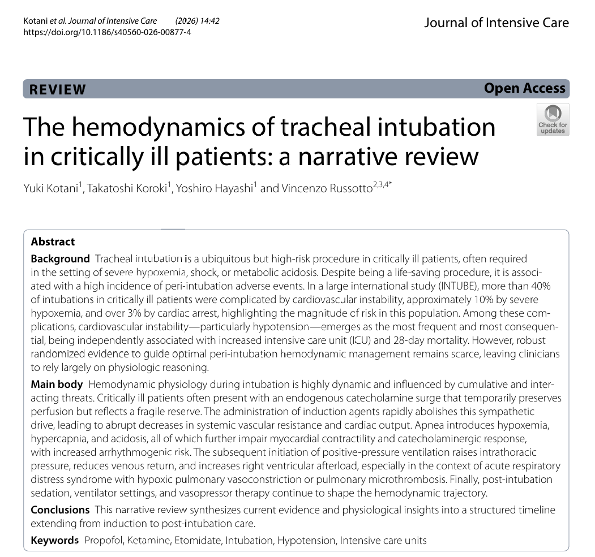

<!-- _class: lead -->

# 重症病人氣管插管的血流動力學
## The Hemodynamics of Tracheal Intubation in Critically Ill Patients
**謝慕揚 MD, PhD, FESC** | 2026-06-10
Kotani Y, Koroki T, Hayashi Y, Russotto V. *J Intensive Care.* 2026;14:42.
[原文連結 (DOI) — Open Access](https://doi.org/10.1186/s40560-026-00877-4)

---

# 為什麼重要：INTUBE 的數字

重症病人插管時常已合併 **低血容、vasoplegia、低血氧、酸中毒**。

| 併發症 | 發生率 |
|--------|--------|
| **心血管不穩定 (cardiovascular instability)** | **42.6%** |
| 嚴重低血氧 (severe hypoxemia) | 9.3% |
| 心跳停止 (cardiac arrest) | 3.1% |

> **插管相關低血壓**是最常見、後果最嚴重的併發症——**獨立**與較高的 ICU 與 28 天死亡率相關，**即使只是短暫的低血壓**。

---

# 生理性困難氣道 (physiologically difficult airway)

- **解剖性困難氣道**：看不到、放不進（機械性挑戰）。
- **生理性困難氣道**：病人本身的**心肺脆弱性**，使其在插管時極易生理崩潰。

兩者**會重疊並互相加成**。

> **一次就成功 (first-pass success) 本身就是一種血流動力學保護**——首次插管失敗與後續不良事件風險增加相關。

---

<!-- _class: divider -->
# Part 1：把插管看成「時間軸」

---

# ⭐ Figure 1：五階段血流動力學時間軸

```text
驅動力： 兒茶酚胺激增 → 交感被阻斷 → 低血氧/酸中毒 → 胸內壓上升
階段：  Pre-induction → Induction → Apnea → PPV → Post-intubation
```

| 參數 | ①Pre-ind. | ②Induction | ③Apnea | ④PPV↑ITP | ⑤Post |
|------|:---:|:---:|:---:|:---:|:---:|
| **SVR 全身血管阻力** | ↑ | ↓↓ | ↓ | ↓ | ↓ |
| **RV 後負荷** | – | – | ↑(HPV) | ↑↑ | ↑ |
| **靜脈回流** | – | ↓ | ↓ | ↓↓ | ↓ |
| **心肌收縮力** | ↑ | ↓ | ↓↓ | ↓ | ↓ |

> 威脅是**累加 (cumulative)** 的，不是孤立事件。

---

# 怎麼讀這張圖：穩定是假象

- 插管前的「穩定」是靠**高交感張力 (high sympathetic drive)** 撐住的——
  代表的是**有限的生理儲備**，不是真正的循環強韌。
- 誘導藥一下去 → **sympatholysis** → 平衡瞬間瓦解、暴露隱藏的循環脆弱性。

> **臨床意義**：把插管視為一條 **trajectory（軌跡）** 而非單一瞬間 → 才能**預先 (anticipate)** 在每個脆弱點佈防。

---

<!-- _class: divider -->
# Part 2：四個累加的機轉

---

# 機轉 ①②：誘導期崩潰 + 缺氧/apnea

### ① 腎上腺素性崩潰 (adrenergic collapse)
- 內源性**兒茶酚胺激增**暫時維持灌流 → 反映**脆弱儲備**。
- 誘導藥廢除交感驅動 → **SVR 與心輸出量急遽下降**。

### ② 低血氧與呼吸暫停的心臟後果
- Apnea → 去飽和、高碳酸血症、酸中毒快速發生。
- 進一步**抑制收縮力**、削弱兒茶酚胺反應、**增加心律不整風險**。

---

# 機轉 ③：右心室衰竭與 HPV

- **右冠狀動脈 (RCA) 雙相灌流**（收縮+舒張）→ RV 對短暫低血氧相對耐受。
- 但 **RV 壁薄**，對壓力負荷敏感。
- **低血氧性肺血管收縮 (HPV)** + ARDS **肺微血栓** → 肺血管阻力↑ → RV 後負荷↑。

> **惡性循環**：RV 後負荷↑ → LV 充盈↓ → RCA 血流↓ → **RV 缺血 → 循環崩潰**。

---

# 機轉 ④：心肺交互作用（轉到 PPV）

- 自主呼吸：**吸氣負壓**促進靜脈回流；吐氣末肺血管阻力最低。
- 改正壓通氣：胸內壓↑ → **右房靜脈回流梯度↓** → 系統性低灌流；肺容積↑ → 肺血管阻力↑ → RV 變差。
- **平均氣道壓**愈高衝擊愈大，**PEEP** 是主要變數（低血容者尤甚）。

> **PEEP 先設低 (5–6 cmH₂O)**，穩定後再漸進到目標。清醒插管可保留負壓吸氣的好處（需高度技術）。

---

<!-- _class: divider -->
# Part 3：Peri-intubation 照護組合

---

# 準備 + 誘導藥選擇

**準備**：事先定義的**檢核表**（要含**生理最佳化**策略，不只器械）+ 團隊溝通、角色分配、應變計畫。

| 誘導藥 | 血流動力學 |
|--------|-----------|
| **Propofol** | **不論劑量**都與不穩定相關 → 高風險避免 |
| **Ketamine / Etomidate** | 耐受較佳（孰優未定）→ **優先** |
| **Remimazolam** | 有潛力，重症證據不足 |

> 給神經肌肉阻斷劑時務必**給足鎮靜**，避免**術中知曉 (accidental awareness during paralysis)**。
> **麻痺 ≠ 睡著**：麻痺藥只讓肌肉不動，意識要靠鎮靜藥關掉。

---

# 輸液 + 預先性升壓劑 + 監測

### 個別化輸液
- **常規 fluid bolus 無證據支持。**
- 同時評估**輸液反應性**（PLR、脈壓變異）與**輸液耐受性**；focused US（IVC / B-line）輔助。

### 預防 > 反應
- **預先性升壓劑 (pre-emptive vasopressor)** 優於等低血壓才給。
- **誘導前放 arterial line**（連續血壓監測減少低血壓暴露）；重複心超評估左右心。

---

# 預充氧 + 喉鏡 + 插管後

| 預充氧 | 重點 |
|--------|------|
| **NIV** | **第一線**（耐受時）；P/F < 200 降低血氧最佳；但正壓壓迫靜脈回流要監測 |
| **HFNC** | 優於 facemask；可於 apnea 期做**呼吸暫停氧合** |

- **影像喉鏡 (videolaryngoscopy) 為第一線**：首次成功率較高、減少食道插管/吸入。
- **插管後**：PPV↑胸內壓 → 預期並滴定升壓劑/輸液；PEEP 5–6 起手；鎮靜謹慎（避免血管擴張與交感反彈）。

---

# 重要試驗與證據

| 試驗 / 研究 | 重點 |
|------------|------|
| **INTUBE** | 42.6% 心血管不穩定、9.3% 嚴重低血氧、3.1% 心跳停止 |
| **PREVENTION** (NCT05014581) | 進行中 RCT：預先性升壓劑 |
| **FLUVA** (NCT05318066) | 進行中 RCT：輸液 vs 升壓劑 |
| 預充氧網狀統合分析 | NIV 最佳，尤其 P/F < 200 |
| 影像喉鏡多中心 RCT | 首次成功率優於直接喉鏡 |

> 高品質的「預先性策略」RCT 結果即將揭曉。

---

# Take-home

> 1. ICU 插管是**血流動力學介入**，有**可預測、分階段**的脆弱點。
> 2. 插管前的「穩定」是**高交感撐住的假象**；誘導 → sympatholysis → 崩。
> 3. **四威脅累加**：藥物 → 缺氧/酸中毒 → ↑胸內壓 → 失去交感驅動。
> 4. 誘導藥選 **ketamine / etomidate**，避免 propofol。
> 5. **預防勝於反應**：art-line、預先性升壓劑、個別化輸液、NIV 預充氧、影像喉鏡求一次成功。
> 6. **PEEP 先低 (5–6)**，插管後持續滴定。

---

<!-- _class: small-text -->
# 參考文獻

1. Kotani Y, Koroki T, Hayashi Y, Russotto V. The hemodynamics of tracheal intubation in critically ill patients: a narrative review. *J Intensive Care.* 2026;14:42. [doi.org/10.1186/s40560-026-00877-4](https://doi.org/10.1186/s40560-026-00877-4) ｜ [PMC13151387](https://www.ncbi.nlm.nih.gov/pmc/articles/PMC13151387/) ｜ [PubMed 41897018](https://pubmed.ncbi.nlm.nih.gov/41897018/)
2. INTUBE study (Russotto V, et al.) — 本篇參考文獻 [2]。[PubMed 搜尋](https://pubmed.ncbi.nlm.nih.gov/?term=INTUBE+Russotto+intubation+critically+ill)
3. PREVENTION — [NCT05014581](https://clinicaltrials.gov/study/NCT05014581)　4. FLUVA — [NCT05318066](https://clinicaltrials.gov/study/NCT05318066)

讀書會共筆整理 · 僅供醫療專業人員教學參考 · 數據引自上述 narrative review

---

<!-- _class: lead -->
# 謝謝聆聽
## Q & A
**謝慕揚 MD, PhD, FESC** · 結構性心臟病與介入心臟學
